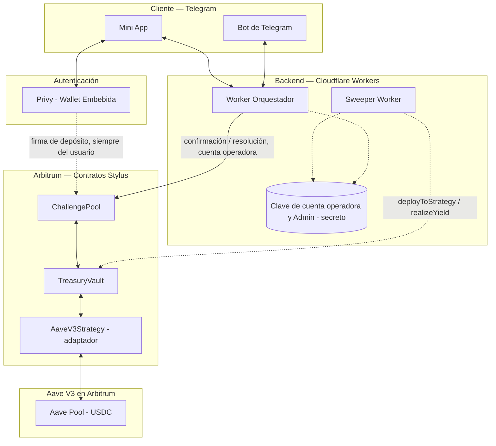
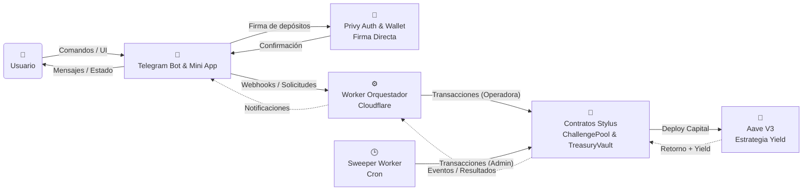

# OtterPot 🦦

Plataforma de retos entre amigos con pozo de premios compartido, construida sobre Arbitrum (Stylus). La interfaz de usuario vive enteramente en Telegram (bot + Mini App).

Este proyecto fue desarrollado para la **Hackathon Ethereum Lima 2026** (Track de Arbitrum).

## 📌 El Problema y Nuestra Solución (Propuesta de Valor)

OtterPot resuelve la necesidad de gestionar apuestas informales o retos de compromiso entre amigos (ej. constancia deportiva, metas personales) de manera transparente y segura, evitando la fricción de la custodia manual o las dudas sobre la honestidad de la validación.

Un grupo de personas define un reto, cada participante deposita una cuota en USDC en un smart contract que actúa como custodio del pozo. Durante la duración del reto, el capital agregado se delega a una estrategia de rendimiento. Al finalizar, el pozo (capital original + rendimiento generado) se libera automáticamente al ganador según un consenso predefinido de manera verificable.

## ⚙️ Tecnologías y Uso del Ecosistema Arbitrum

El proyecto busca demostrar una implementación técnica sólida y una integración profunda con la red utilizando **Scaffold-Stylus**:

- **Smart Contracts en Rust (Stylus)**: Aprovechamos Arbitrum Stylus para escribir contratos de alto rendimiento. Utilizamos `ChallengePool` para custodiar los retos individuales y `TreasuryVault` para gestionar la tesorería de forma agregada utilizando contabilidad por participaciones (*shares*).
- **Ecosistema Arbitrum y DeFi**: Los fondos en espera son depositados en **Aave V3 (Arbitrum)** para generar rendimiento (*yield*) mientras el reto está activo, aprovechando la liquidez del ecosistema.
- **Frontend y UX**: Bot de Telegram + Mini App interactiva con **Privy** para abstracción de wallets. Esto elimina las barreras de entrada para usuarios tradicionales (Web2), ofreciendo una experiencia fluida sin salir de Telegram.
- **Backend (Orquestador)**: Cloudflare Workers para gestionar la interacción asíncrona entre Telegram y los smart contracts, manteniendo de forma segura la orquestación off-chain.

## 🏗️ Arquitectura y Flujo del Producto

Para facilitar la comprensión del sistema (especialmente para el jurado y las presentaciones de pitch), a continuación se presentan los diagramas de alto nivel que ilustran cómo interactúan los componentes sin exponer detalles internos sensibles.

### 1. Diagrama de Arquitectura General

Este diagrama ofrece una vista macro del sistema separada por capas lógicas (Cliente, Autenticación, Backend, Blockchain y Externos), ideal para entender dónde "vive" cada pieza tecnológica de la plataforma y cómo se conectan los mundos off-chain y on-chain.

### 2. Diagrama de Comunicación General

Este esquema organiza el sistema separando de forma clara la "Ruta de Interacción del Usuario" en la parte superior, de la "Ruta de Delegación del Backend" en la inferior. Es muy útil para explicar el diseño asíncrono y los diferentes actores (incluyendo la tarea cronográfica `Sweeper`).

## 🚀 Entregables Hackathon ETH Lima 2026

- **🎥 Video Pitch:** [Enlace pendiente]
- **📑 Pitch Deck:** [Enlace pendiente]
- **🚀 Link Demo:** [Enlace pendiente]
- **🎬 Video Demo:** [Enlace pendiente]
- **🏗️ Link Arquitectura:** [Enlace pendiente a diagrama público]

### 📜 Smart Contracts Desplegados (Arbitrum Sepolia)

| Contrato | Dirección | Explorador (Arbiscan) |
| ---------- | ----------- | ----------------------- |
| `ChallengePool` | `0xbc0ce54d80b3f95067285297f6ec052e79ecef46` | [Enlace pendiente] |
| `TreasuryVault` | `0xa30a7f61ae8b463b62701aebe3c42a00cf359a8f` | [Enlace pendiente] |
| `AaveV3Strategy` | `0x5abb4b394198a8cb93cdc202cd67dc5618d9b5ff` | [Enlace pendiente] |

*(Nota: En la red de pruebas Arbitrum Sepolia interactuamos con el USDC nativo de Circle).*

## 🛠 Instalación y Ejecución

Consulta nuestra guía rápida para levantar el proyecto y los contratos en tu entorno local:
👉 **[Quick Start](QUICKSTART.md)**

## 📖 Documentación Adicional

- [Design Guide](DESIGN.md) – Identidad visual.
- [AGENTS.md](AGENTS.md) – Guía para asistentes de IA.
- [GEMINI.md](GEMINI.md) – Guía específica de contexto de IA.

*(Nota: La documentación detallada de diseño de software `SDD.md` se mantiene en el repositorio como referencia técnica principal para el equipo de desarrollo).*

## 📄 Licencia

Este proyecto está bajo la Licencia Apache 2.0. Ver el archivo [LICENSE](LICENSE) para más detalles.
