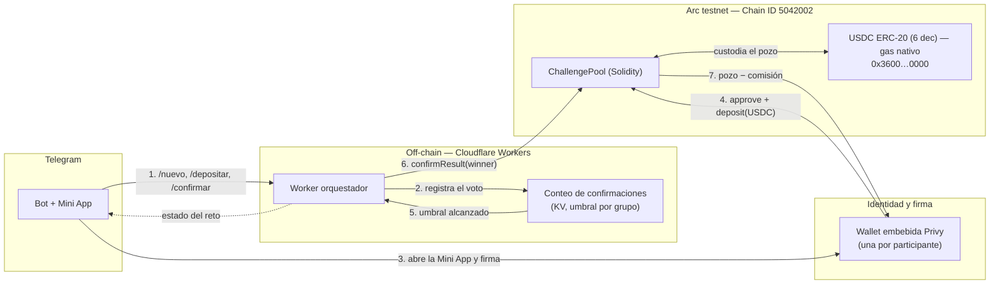

# OtterPot 🦦

Plataforma de retos entre amigos con pozo de premios compartido. La interfaz de
usuario vive enteramente en Telegram (bot + Mini App).

Este repositorio se presentó originalmente a **ETH Lima 2026** (track de
Arbitrum) y se extendió en **ETHOnline 2026** (track Continuity) con un port a
**Arc**, la L1 de Circle. La sección siguiente separa explícitamente **qué
existía antes** de **qué se construyó durante ETHOnline**.

---

## 🆕 ETHOnline 2026 — track Continuity (trabajo nuevo)

El entregable de ETHOnline 2026 es un MVP funcional de `ChallengePool` en
**Solidity**, desplegado en **Arc testnet**, con el Worker de Telegram apuntando
a esa red. El rendimiento (contrato `TreasuryVault` y adaptador de Aave) queda
**fuera de esta entrega**: los fondos permanecen en el pozo entre el depósito y
el pago.

### Antes vs. ahora

| | Antes de ETHOnline (ETH Lima 2026) | Construido durante ETHOnline 2026 |
| --- | --- | --- |
| Cadena | Arbitrum (Sepolia / One) | **Arc testnet** (Circle) |
| Contratos | **Rust / Stylus** (WASM sobre Nitro): `ChallengePool`, `TreasuryVault`, `AaveV3Strategy` | **Solidity / Foundry**: `ChallengePool` (reescritura, no port — Stylus no compila a EVM) |
| Rendimiento | Depósito en **Aave V3** vía adaptador intercambiable | **No incluido** (recortado del alcance) |
| Worker | Apuntaba al ABI de Stylus en Arbitrum | **Apuntado a Arc** + decodificador de errores personalizados del contrato Solidity |
| Paquete | `packages/stylus` (sin cambios por este delta) | `packages/arc` (nuevo) |

Los commits del delta **no modifican los contratos Rust de `packages/stylus`**:
quedan como el entregable previo de ETH Lima para que la separación entre lo
viejo y lo nuevo sea verificable en el propio árbol del repo.

**Cómo verificar el delta:** son los PRs **#11** (port a Solidity), **#12**
(despliegue en Arc) y **#13** (Worker → Arc). En el historial, los archivos
nuevos viven en `packages/arc/` y los cambios del Worker en
`packages/worker/src/`.

### Flujo en Arc

`Telegram (bot) → Worker → wallet Privy → ChallengePool en Arc → pago al ganador`

El consenso entre participantes vive **off-chain** (conteo de votos en el
Worker); la liquidación y la ruta de fondos son **on-chain**. El diagrama
completo, con el detalle de cada paso, está versionado en
[`docs/diagrams/arc-flow.md`](docs/diagrams/arc-flow.md):



### Despliegue en Arc testnet

| | |
| --- | --- |
| Red | Arc testnet |
| Chain ID | `5042002` |
| RPC | `https://rpc.testnet.arc.io` |
| Explorador | <https://testnet.arcscan.app> |
| **ChallengePool** | [`0x3953ecD3f1797FD18b22a151fEF20C3f5Ae0aD0B`](https://testnet.arcscan.app/address/0x3953ecD3f1797FD18b22a151fEF20C3f5Ae0aD0B) |
| USDC (ERC-20 de sistema, 6 dec) | `0x3600000000000000000000000000000000000000` |
| Comisión base | 500 bps (5 %) |

Ciclo completo ejecutado contra la red real (evidencia on-chain):

| Paso | Transacción |
| --- | --- |
| Despliegue | [`0x00df8e9d…af7e7f`](https://testnet.arcscan.app/tx/0x00df8e9d26d16803e995a2989518a0a47b047514ff5a52c8fdd4f727b0af7e7f) |
| `createChallenge` (1 USDC × 3) | [`0x4b3a9fc3…7f8c96`](https://testnet.arcscan.app/tx/0x4b3a9fc3ac12fbef2876cca9e23c5557a4e79a9735622a23c087c19ca17f8c96) |
| Depósito P1 | [`0x6ab74b64…b6d41056`](https://testnet.arcscan.app/tx/0x6ab74b64a69340317c43349242aa78f75a6898f3b30a7e994de0f012b6d41056) |
| Depósito P2 | [`0xce2b3fba…26b17aa`](https://testnet.arcscan.app/tx/0xce2b3fbab5d491cb494617cc86c1e41e2120c378b9160741701cf8aba26b17aa) |
| Depósito P3 | [`0x3cb4908e…f305014ae`](https://testnet.arcscan.app/tx/0x3cb4908ec3b5a3e4ac366530f58c93e0767e8d89fb5ef443af7efbbf305014ae) |
| `confirmResult` | [`0xeb8ceffd…ab1f179`](https://testnet.arcscan.app/tx/0xeb8ceffdccccf2e46ab187881153167c5d8cae0149320bba94aff4fb7ab1f179) |

Direcciones, argumentos del constructor y hashes en
[`packages/arc/deployments/arc-testnet.json`](packages/arc/deployments/arc-testnet.json).

### Herramientas de Circle (Arc) y de Privy — roles separados

- **Circle / Arc** es la red y el activo. Arc es una L1 EVM (Solidity, Foundry,
  viem) donde **USDC es el gas nativo** y expone una interfaz dual sobre un
  mismo saldo: nativa de 18 decimales y ERC-20 de 6 decimales. La lógica de
  aplicación usa la interfaz ERC-20; por eso `ChallengePool` no tiene funciones
  `payable`. El USDC es un contrato de sistema presente desde el génesis, no un
  token desplegado, y no existe USDC envuelto.
- **Privy** es la identidad y la firma dentro de Telegram: una wallet embebida
  por participante, sin frase semilla ni extensión de navegador. Habilita el
  depósito con firma directa del usuario (paso 4 del diagrama); el Worker nunca
  firma depósitos, solo relaya la resolución ya consensuada.

> La elegibilidad de OtterPot para los premios de Privy está en verificación
> (issue #2). Si se confirma, la integración de Privy se profundiza según la
> issue #6.

### Desarrollo del contrato en Arc

```bash
cd packages/arc
forge build
forge test
```

Sin dependencias externas: `forge-std` no se usa (los tests declaran una
interfaz `Vm` mínima). Detalles de despliegue y particularidades de Arc en
[`packages/arc/README.md`](packages/arc/README.md).

---

## 📌 El Problema y Nuestra Solución (Propuesta de Valor)

OtterPot resuelve la necesidad de gestionar apuestas informales o retos de
compromiso entre amigos (ej. constancia deportiva, metas personales) de manera
transparente y segura, evitando la fricción de la custodia manual o las dudas
sobre la honestidad de la validación.

Un grupo de personas define un reto, cada participante deposita una cuota en
USDC en un smart contract que actúa como custodio del pozo. Al finalizar, el
pozo se libera al ganador según un consenso predefinido de manera verificable.

## ⚙️ Tecnologías

- **Smart contracts:** Rust/Stylus en Arbitrum (ETH Lima) y Solidity en Arc
  (ETHOnline). El `ChallengePool` custodia cada reto; `TreasuryVault` agregaba
  el capital y lo colocaba en rendimiento en la entrega previa.
- **Ecosistema DeFi (entrega ETH Lima):** los fondos en espera se depositaban en
  **Aave V3 (Arbitrum)** para generar rendimiento mientras el reto estaba activo.
- **Frontend y UX:** Bot de Telegram + Mini App con **Privy** para abstracción de
  wallets, eliminando barreras de entrada para usuarios Web2 sin salir de
  Telegram.
- **Backend (orquestador):** Cloudflare Workers para la interacción asíncrona
  entre Telegram y los contratos, con el estado del bot persistido en KV.

## 📚 Documentación

- [SDD](docs/SDD.md) – Especificación de diseño (fuente de verdad técnica).
- [Producto](docs/PRODUCT.md) – Propósito y para quién.
- [Validación](docs/VALIDATION.md) – Stress test de la idea.
- [Bot](docs/BOT.md) – Superficie de comandos de Telegram.
- [Stack](docs/STACK.md) – Mapa de reutilización y stack.
- [Diagrama del flujo en Arc](docs/diagrams/arc-flow.md) – Delta de ETHOnline.
- [Design Guide](DESIGN.md) – Identidad visual.
- [Quick Start](QUICKSTART.md) – Entorno de desarrollo.
- [AGENTS.md](AGENTS.md) / [GEMINI.md](GEMINI.md) – Guías para asistentes de IA.

## 📄 Licencia

Este proyecto está bajo la Licencia Apache 2.0. Ver el archivo
[LICENSE](LICENSE) para más detalles.
