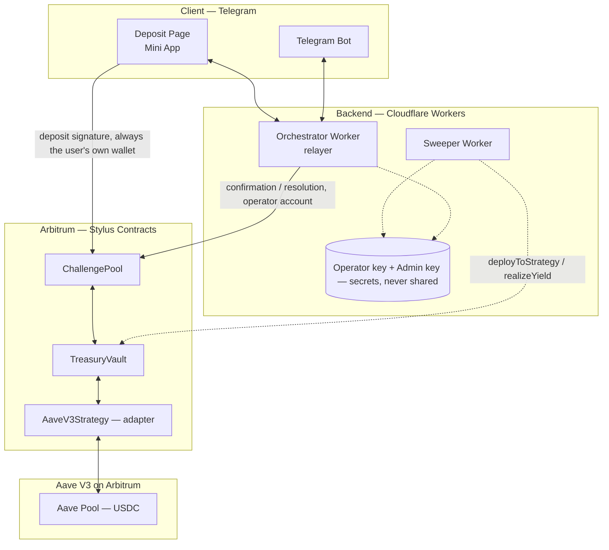
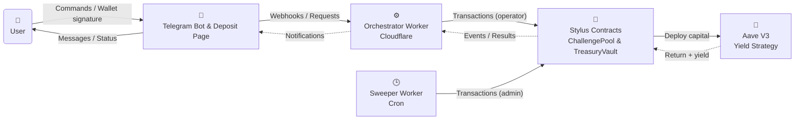

# OtterPot 🦦

Trustless group challenges with a shared, yield-bearing prize pool — built on Arbitrum Stylus, lived entirely inside Telegram.

Built for **Arbitrum Open House Singapore**. The project started at **ETH Lima 2026**, where it placed 2nd — see [Buildathon delta](#-buildathon-delta-what-changed-for-arbitrum-open-house-singapore) for exactly what changed since then.

## 📌 Problem & Solution

Informal bets and commitment challenges between friends (train 3x/week, hit a savings goal, show up every day for a month) usually run on trust alone: someone holds the money, someone decides who won, and both of those steps are invisible to the group. OtterPot replaces that with a smart contract.

A group defines a challenge, each participant deposits a fixed amount of USDC into `ChallengePool`, which locks the pool once everyone has paid in. While the challenge runs, the aggregated capital is deployed to Aave V3 to earn yield through `TreasuryVault`. When the group reaches consensus on a winner, the contract releases the pool automatically — no organizer custody, no manual payout.

We are explicit about one thing: **this is not a "no-loss" product.** The platform charges a commission (capped at 10%), funded first by the yield generated; if yield doesn't cover it, the shortfall comes out of the pool, and the winner can receive less than what the group deposited. We'd rather say that plainly than oversell it.

## ⚙️ Tech & the Arbitrum Ecosystem

- **Smart contracts in Rust (Stylus):** `ChallengePool` custodies each individual challenge; `TreasuryVault` aggregates capital from all active challenges using share-based accounting, so no challenge gains or loses yield depending on what else is running concurrently.
- **Real DeFi integration, not a mock:** idle capital is deployed to **Aave V3 on Arbitrum** through a swappable strategy adapter (`AaveV3Strategy`), governed explicitly (strategy changes require admin approval).
- **Telegram-native UX:** a bot handles challenge creation, deposits, status and resolution; a lightweight web page (opened directly from the bot) handles the two wallet signatures a deposit requires. No app install, no seed phrase screen before the first interaction.
- **Backend (orchestrator):** Cloudflare Workers coordinate between Telegram and the contracts — a relayer counts off-chain confirmations and submits on-chain resolutions, and an independent Sweeper Worker (cron) deploys idle treasury funds to Aave on a schedule, using a separate admin key.

## 🏗️ Architecture

### 1. Component overview

```mermaid
graph TB
    subgraph Client["Client — Telegram"]
        TGBot[Telegram Bot]
        MiniApp[Deposit Page<br/>Mini App]
    end

    subgraph Backend["Backend — Cloudflare Workers"]
        Worker[Orchestrator Worker<br/>relayer]
        Sweeper[Sweeper Worker]
        Secrets[(Operator key + Admin key — secrets, never shared)]
    end

    subgraph Chain["Arbitrum — Stylus Contracts"]
        CP[ChallengePool]
        TV[TreasuryVault]
        YS[AaveV3Strategy — adapter]
    end

    subgraph External["Aave V3 on Arbitrum"]
        Pool[Aave Pool — USDC]
    end

    TGBot <--> Worker
    MiniApp -->|deposit signature, always the user's own wallet| CP
    MiniApp <--> Worker
    Worker -->|confirmation / resolution, operator account| CP
    Sweeper -.->|deployToStrategy / realizeYield| TV
    Worker -.-> Secrets
    Sweeper -.-> Secrets
    CP <--> TV
    TV <--> YS
    YS <--> Pool
```

> The deposit page talks to the chain directly and trusts nothing from the backend — it reads challenge state and signs transactions with the participant's own wallet. An embedded wallet (Privy) is on the roadmap, not in the MVP; today a participant needs a wallet with testnet ETH and USDC already set up (see `docs/SDD.md` §2.2).

### 2. Request flow

```mermaid
graph LR
    USER(👤<br/>User)
    FRONTEND[📱<br/>Telegram Bot & Deposit Page]
    SERVER[⚙️<br/>Orchestrator Worker<br/>Cloudflare]
    SWEEPER[🕒<br/>Sweeper Worker<br/>Cron]
    CONTRACTS[📜<br/>Stylus Contracts<br/>ChallengePool & TreasuryVault]
    AAVE[🏦<br/>Aave V3<br/>Yield Strategy]

    USER -- "Commands / Wallet signature" --> FRONTEND
    FRONTEND -- "Messages / Status" --> USER
    FRONTEND -- "Webhooks / Requests" --> SERVER
    SERVER -. "Notifications" .-> FRONTEND
    SERVER -- "Transactions (operator)" --> CONTRACTS
    SWEEPER -- "Transactions (admin)" --> CONTRACTS
    CONTRACTS -. "Events / Results" .-> SERVER
    CONTRACTS -- "Deploy capital" --> AAVE
    AAVE -. "Return + yield" .-> CONTRACTS

    class SERVER backend;
    class SWEEPER backend;
    class CONTRACTS backend;
    class AAVE backend;
```

## 👥 Team

| Member | Role | What they built |
| --- | --- | --- |
| **Julio Severiche** | Full Stack — Telegram bot & relayer | Full bot (`/nuevo`, `/abrir`, `/estado`, `/retos`, `/confirmar`, `/depositar`, `/reembolso`, `/historial`); persistent relayer consensus on Durable Objects with an explicit transaction lifecycle (`voting → consensus → submitted → confirmed`); receipt-confirmed resolutions, unified chain configuration, serialized nonces. |
| **Moises Cisneros** | Smart Contracts | Original `ChallengePool` contract in Stylus/Rust; published SDD v8 consolidating the team's 10 design decisions (DD-01 to DD-10); implemented the v8 payout model (target commission funded by yield first, `fee_recipient`, 10% commission cap); explored an Arc (Circle) deployment during ETHOnline 2026. |
| **William Yucra** | Business Model — business, demo & pitch | Commission model from a product standpoint; business narrative and pitch; demo script and rehearsal; buildathon delta documentation; post-hackathon grants roadmap; HackQuest submission checklist. |
| **Luishinño Paricena** | Security | Landing page and Mini App screens (ES/EN i18n, PWA, mobile optimization); security review of the v8 contracts; end-to-end and negative tests on Arbitrum Sepolia; Sweeper liquidity buffer; deposit page publication with mobile wallet support. |
| **Fernando Vazquez** | Front | Public architecture diagram; commission/TVL/challenge metrics in the Mini App; repository code of conduct. |

## 🔄 What's new for Arbitrum Open House Singapore

OtterPot was built at **ETH Lima 2026** (2nd place) as an Arbitrum Stylus project. During **ETHOnline 2026** we explored a parallel deployment on Circle's Arc chain (`packages/arc`, Solidity) — that track is no longer active; the contracts shipped for this buildathon are the native Stylus ones in `packages/stylus`.

For **Arbitrum Open House Singapore** we ran every open design question from the original build through an explicit decision log ([`docs/DESIGN_DECISIONS.md`](docs/DESIGN_DECISIONS.md), DD-01 to DD-10) and folded the result into **SDD v8** ([`docs/SDD.md`](docs/SDD.md)). Concretely, this buildathon's work is:

- **Honest payout model.** The previous model let a challenge's yield lift the winner's payout above the pool and let the platform fee silently round to zero. v8 fixes both: the platform always receives its target commission (yield pays for it first, participants only cover the shortfall, capped at 10%), the winner never receives more than the pool, and the commission is paid directly to an auditable `fee_recipient` instead of sitting as idle balance in the pool.
- **No more challenges that can never lock.** Roster validation at creation rejects duplicate addresses, an empty roster, or a deadline in the past.
- **Nothing gets trapped.** A challenge can now be cancelled while still in the `Open` state, with a 100% refund to anyone who already deposited.
- **Correct yield accounting.** `TreasuryVault` now accrues yield (and recognizes losses) on every deposit and redemption, not only when the cron happens to run — so a challenge that joins late doesn't buy shares at a stale price.
- **A relayer that doesn't lose votes.** Confirmation state moved from an in-memory store (gone on every Cloudflare Worker restart) to a Durable Object per challenge, with receipt-confirmed resolutions and serialized transactions to prevent nonce collisions.

Full roadmap, phase dependencies and release gates: [`docs/ROADMAP.md`](docs/ROADMAP.md). Test strategy: [`docs/TESTING.md`](docs/TESTING.md).

## 🚀 Arbitrum Open House Singapore Deliverables

- **🎥 Pitch video:** [link pending]
- **📑 Pitch deck:** [link pending]
- **🚀 Live demo link:** [link pending]
- **🎬 Demo video:** [link pending]
- **🏗️ Architecture diagram link:** [link pending]

### 📜 Deployed Smart Contracts (Arbitrum Sepolia)

| Contract | Address | Explorer |
| --- | --- | --- |
| `ChallengePool` | `0x7f02be32247ca5c32468d69ef059e4a9114e56d4` | [link pending] |
| `TreasuryVault` | `0xcb002f054b25d699a4c986cebe3e1f03ac58b8f6` | [link pending] |
| `AaveV3Strategy` | `0x0b9d7689e1ab14202868ffb23db62ffc92aa22e7` | [link pending] |

*(Arbitrum Sepolia testnet, using Circle's native USDC at `0x75faf114eafb1BDbe2F0316DF893fd58CE46AA4d`.)*

> **These are the pre-v8 addresses, currently live.** The v8 contracts are not upgradeable and ship as one coordinated redeployment (`docs/DESIGN_DECISIONS.md`, DD-09, tracked in issue #24) — this table will be updated the moment that lands, together with Arbiscan verification links.

## 🛠 Installation & Running Locally

See our quick start guide to get the project and contracts running on your machine:
👉 **[Quick Start](QUICKSTART.md)**

## 📖 Additional Documentation

- [SDD — Software Design Document](docs/SDD.md) — source of truth for business and architecture.
- [ROADMAP](docs/ROADMAP.md) — MVP definition, workstreams and phase dependencies for this buildathon.
- [DESIGN_DECISIONS](docs/DESIGN_DECISIONS.md) — the DD-01 to DD-10 decision log behind SDD v8.
- [TESTING](docs/TESTING.md) — test and validation strategy.
- [Design Guide](DESIGN.md) — visual identity.
- [CONTRIBUTING](CONTRIBUTING.md) — how to contribute.
- [AGENTS.md](AGENTS.md) / [GEMINI.md](GEMINI.md) — guides for AI coding assistants working in this repo.

## 📄 License

This project is licensed under Apache 2.0. See [LICENSE](LICENSE) for details.
