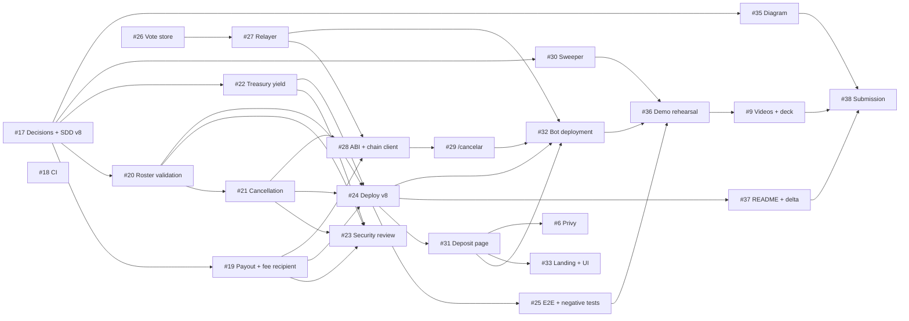

# OtterPot Roadmap

OtterPot is a platform for challenges between friends with a shared prize pool, built on Arbitrum (Stylus/Rust) with Telegram as the user interface. This document defines the MVP for the **Arbitrum Open House Singapore** buildathon, the workstreams that deliver it, and the order in which they are built.

- Business and architecture specification: [`SDD.md`](SDD.md) (source of truth)
- Design decisions for the current iteration: [`DESIGN_DECISIONS.md`](DESIGN_DECISIONS.md)
- Test and validation strategy: [`TESTING.md`](TESTING.md)
- How to contribute: [`../CONTRIBUTING.md`](../CONTRIBUTING.md)
- Work items: GitHub milestone **ArbitrumSingapur**

## 1. MVP definition

The MVP demonstrates one coherent story: *a group pot that lives in Telegram, is locked in a Stylus contract, earns yield on Aave, and is paid out only to the winner the group chose.*

| # | Step | What happens | Components |
| --- | --- | --- | --- |
| 1 | Create | In a Telegram group: `/nuevo 5 24`, friends press **Me sumo**, the creator runs `/abrir`. The challenge is created on Arbitrum Sepolia. | Bot, relayer, `ChallengePool` |
| 2 | Deposit | Each participant opens the deposit page and signs `approve` + `deposit` with their own wallet. | Mini App, `ChallengePool`, USDC |
| 3 | Lock | When the last participant deposits, the challenge becomes **Bloqueado** and the pool moves into the treasury in exchange for shares. | `ChallengePool`, `TreasuryVault` |
| 4 | Earn | The Sweeper deploys idle treasury funds to Aave V3 and accounts for the yield. Yield offsets the platform fee (or generates surplus); the demo shows Aave integration, while the pitch focuses on automated pool custody rather than "the pot grows" or "no-loss". | Sweeper, `TreasuryVault`, `AaveV3Strategy`, Aave |
| 5 | Resolve | Participants vote with `/confirmar`. On consensus the relayer submits the result, the winner is paid and the platform fee reaches the fee recipient. | Bot, relayer, `ChallengePool` |
| 6 | Cancel | A challenge where someone never deposits is cancelled with `/cancelar` and every depositor recovers 100 % of their deposit. | Bot, relayer, `ChallengePool` |

Every step produces on-chain transactions that are recorded in `docs/evidence/` and can be inspected on Arbiscan.

### Out of scope for the MVP

AI judge mode, veto window, full Privy embedded-wallet integration (UX mockups are provided instead), fiat off-ramp, multi-chain support, fundraising (external-destination) challenges, and claiming "no-loss" or "the pot grows" (under Option A, platform commission is deducted from the pool if yield does not cover it; yield is real but small at MVP scale). These are planned for later iterations and are described in [`SDD.md`](SDD.md) §2.2.

## 2. Workstreams and status

| Workstream | Owner | Status |
| --- | --- | --- |
| Contracts (`ChallengePool`, `TreasuryVault`, `AaveV3Strategy`) | Moises | Deployed on Arbitrum Sepolia. Iteration "v8" (payout model, fee recipient, roster validation, cancellation, yield accounting) is specified in [`DESIGN_DECISIONS.md`](DESIGN_DECISIONS.md) and scheduled below. |
| Relayer (consensus counting and transaction submission) | Julio | Implemented. Reliability work (persistent atomic vote store, receipt confirmation, single chain configuration) scheduled. |
| Telegram bot | Julio | Implemented: `/nuevo`, `/abrir`, `/estado`, `/retos`, `/confirmar`, `/depositar`, `/reembolso`, `/historial`, group configuration. `/cancelar` and `/verificar` are specified, not yet implemented. |
| Sweeper (cron, treasury automation) | Luishiño | Implemented. Liquidity buffer, truthful result states and yield accounting on every run scheduled. |
| Mini App and landing | Luishiño, Fernando | Deposit page implemented (`packages/nextjs/app/depositar`). Public deployment and mobile wallet support scheduled. |
| Security review | Luishiño | Scheduled after the contract changes land. |
| Documentation, demo and submission | Moises, Fernando, William | Scheduled. |

## 3. Phases and dependencies

A work item starts when everything it depends on is merged. Many items run in parallel until they reach their blocking point: for example, the relayer work does not wait for the contract changes.

| Phase | Work items | Outcome |
| --- | --- | --- |
| **0. Foundation** | #17 decisions and SDD v8 · #18 CI | Design agreed and written into the SDD; CI validates every pull request |
| **1. Contracts v8** | #19 payout and fee recipient · #20 roster validation · #21 cancellation · #22 treasury yield accounting · #23 security review | Contracts match the specification and are covered by tests |
| **2. Deployment** | #24 deployment, ABI export and verification · #25 end-to-end and negative tests | v8 live on Arbitrum Sepolia, verified on Arbiscan and exercised end to end |
| **3. Relayer, bot and sweeper** | #26 vote store · #27 relayer · #28 ABI and chain client · #29 cancellation command · #30 sweeper · #32 bot deployment | Reliable orchestration. Starts in parallel with phase 1 |
| **4. Mini App** | #31 public deposit page · #33 landing and UI · #6 Privy | Public, presentable deposit flow |
| **5. Evidence and submission** | #34 gas measurements · #35 architecture diagram · #36 demo script and rehearsal · #9 videos and deck · #37 README and delta · #38 submission · #39 grants roadmap | Demo, documentation and submission |
| **Later** | #40 USDG · #41 pilot · #42 metrics · #43 code of conduct | Post-MVP |

**Critical path:** #17 → (#19 / #20 → #21, #22) → #24 → #31 → #32 → #36 → #9 → #38.

**Independent starts:** #17, #18, #26 and #43 have no dependencies.

## 4. Release gates

The MVP is ready when all of the following hold:

- [ ] Steps 1 to 6 run back to back on Arbitrum Sepolia without manual intervention, and the transaction hashes are stored in `docs/evidence/`.
- [ ] Every contract address in the submission opens a verified contract on Arbiscan.
- [ ] A new participant can open the bot, create a challenge and deposit from the public deposit page.
- [ ] `cargo test` (contracts), `npm test` (worker and sweeper) and the repository CI are green.
- [ ] [`SDD.md`](SDD.md) and the code describe the same behavior.
- [ ] The demo and the pitch only claim what the product does.

## 5. Scope control

- Contract changes ship as **one coordinated redeployment** (see [`DESIGN_DECISIONS.md`](DESIGN_DECISIONS.md) DD-09). Every redeployment requires updating the worker, sweeper, Mini App and scripts.
- Phase 3 work that does not depend on the new ABI proceeds without waiting for phase 2.
- If a contract change is not ready for the redeployment, the currently deployed contracts remain the reference and the difference is documented in [`SDD.md`](SDD.md) as a known limitation.

## 6. Project history

- **Ethereum Lima 2026** — the project was created for this hackathon and placed 2nd.
- **ETHOnline 2026** — exploration of an Arc deployment (Solidity port in `packages/arc`).
- **Arbitrum Open House Singapore** — this iteration: Stylus contracts on Arbitrum, Aave V3 yield, and a reliable Telegram-based flow.
