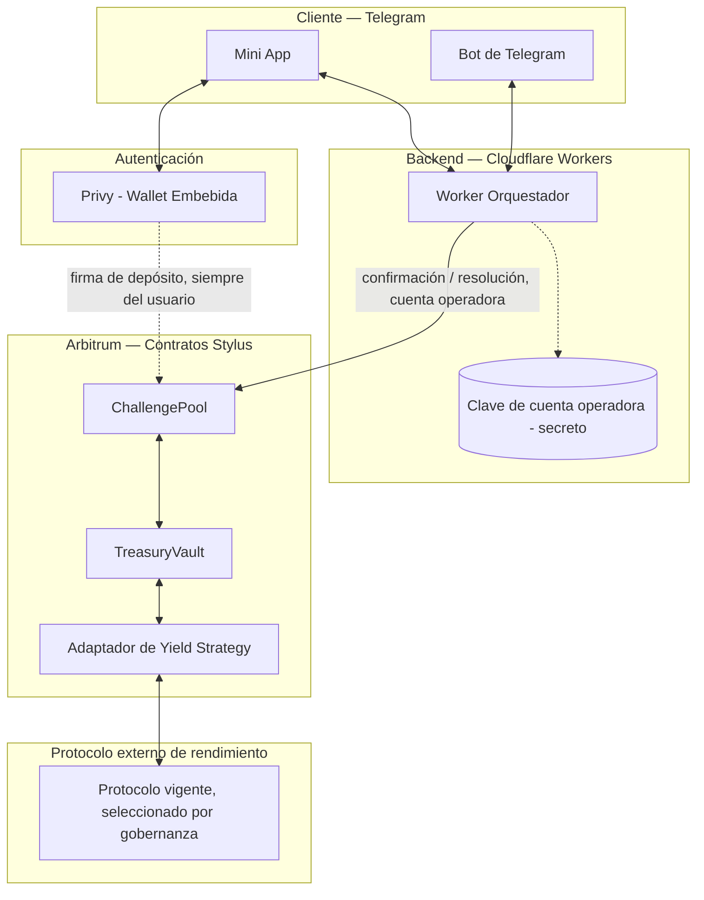
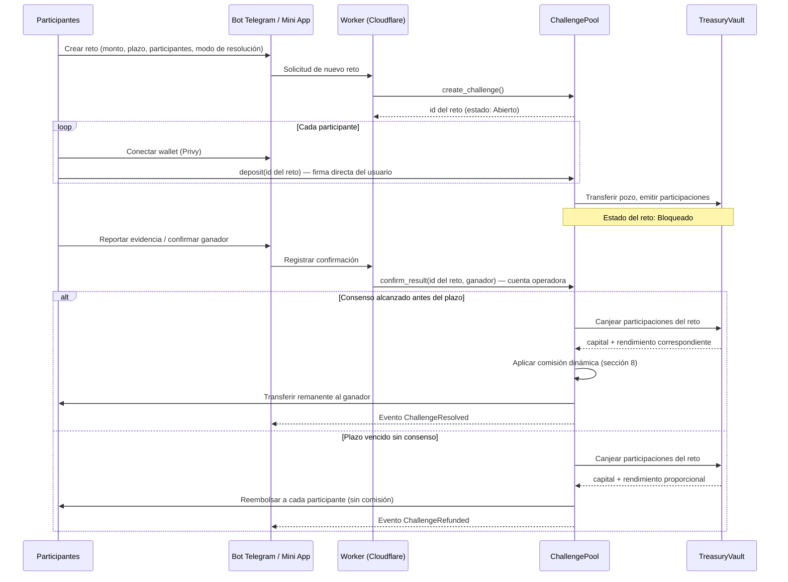
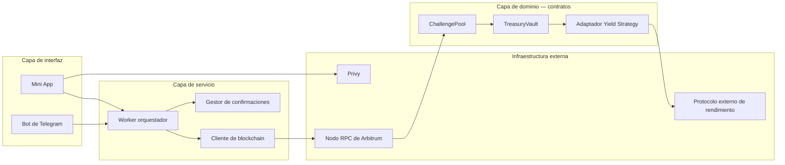
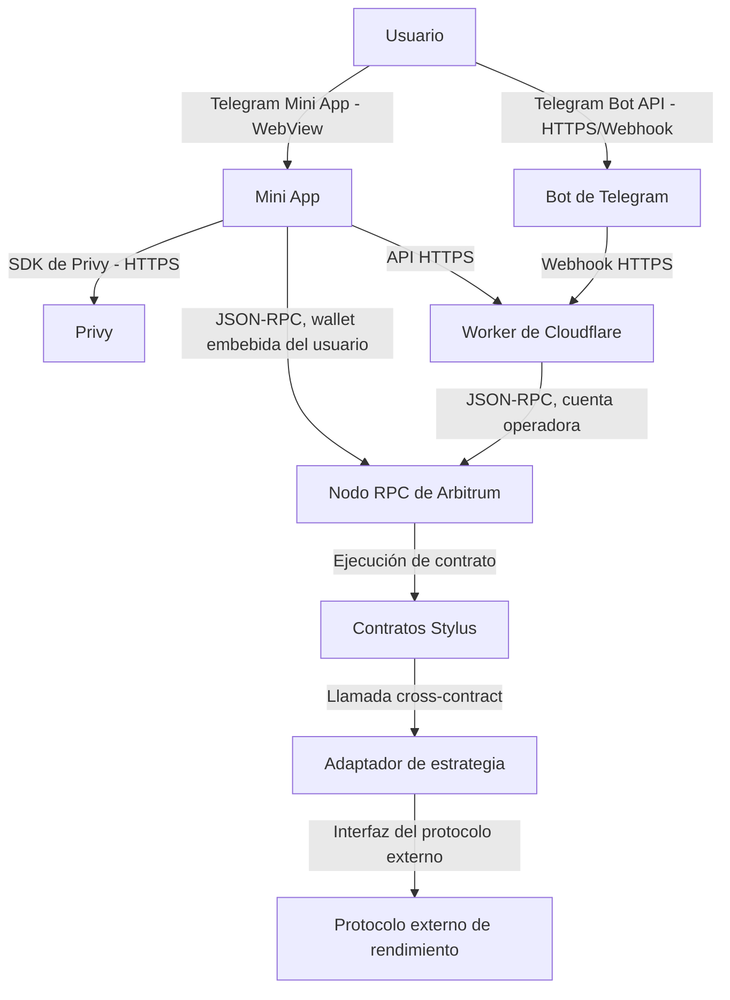

# Especificación de Diseño de Software (SDD)
## OtterPot — Plataforma de retos entre amigos con pozo compartido en Arbitrum

| Campo | Valor |
|---|---|
| Track | Arbitrum — ETH Lima 2026 |
| Estado | v4 — nombre e identidad definidos |
| Base de este documento | Reunión de equipo del 4 ago 2026 + sesiones de diseño posteriores |
| Alcance de detalle | Documento de referencia para todo el equipo; profundidad técnica adicional en los módulos de Smart Contract y Backend |
| Identidad visual | `DESIGN.md` — nombre, mascota, paleta y directrices de UI |
| Fundamentos de producto | `docs/PRODUCT.md` (qué es y para quién) y `docs/VALIDATION.md` (si aguanta) |

---

## 1. Propósito y visión del producto

**OtterPot** es una infraestructura de retos con premio compartido, accesible enteramente desde Telegram, construida sobre Arbitrum. Un grupo de personas define un reto, cada participante deposita una cuota en un smart contract que actúa como custodio transparente del pozo, y al finalizar el reto el pozo se libera automáticamente al ganador según reglas de validación definidas de antemano.

El nombre viene de la nutria (*otter*) que sostiene una olla (*pot*): el animal que guarda el pozo del grupo sin quedárselo. La identidad visual completa —mascota, paleta y directrices de UI— vive en `DESIGN.md`.

La visión de largo plazo es que esta infraestructura sirva tanto para retos informales entre amigos (deporte, hábitos, retos creativos) como, en una fase posterior, para contextos más rigurosos como hackathons o comunidades grandes, mediante modos de resolución configurables.

## 2. Alcance

### 2.1 Dentro del alcance del MVP (4 días de desarrollo)

- Un smart contract en Stylus que gestiona múltiples retos de forma simultánea.
- Un caso de uso de validación completamente funcional: reto físico/deportivo con confirmación por consenso de participantes.
- Bot de Telegram con Mini App para crear retos, depositar, confirmar resultados y consultar el estado del pozo.
- Autenticación y wallet embebida mediante Privy.
- Modelo de comisión porcentual funcionando de extremo a extremo.
- Arquitectura de tesorería con contabilidad por participaciones, lista para conectarse a un protocolo de rendimiento externo, aunque la integración con dicho protocolo puede quedar como demostración parcial si el tiempo no alcanza.

### 2.2 Fuera del alcance del MVP (roadmap)

- Integración real con SDK de actividad física (Google Fit / Health Connect) — el MVP valida por evidencia y consenso, no por datos biométricos automatizados.
- Integración de cobro/off-ramp con El Dorado u otro proveedor de conversión a moneda local.
- Wallets inteligentes individuales por usuario (account abstraction completa).
- KYC para retos comunitarios grandes o de montos elevados.
- Modo "juez" para hackathons/comunidades, aunque el contrato lo soporta desde el diseño.
- Soporte multiplataforma más allá de Telegram.

## 3. Glosario

- **Reto (Challenge):** unidad básica del producto. Agrupa participantes, un monto de depósito, un plazo, un modo de resolución y un estado.
- **Pozo:** suma de los depósitos de todos los participantes de un reto.
- **Tesorería:** componente que agrupa el capital de todos los retos activos y lo coloca en una estrategia de generación de rendimiento.
- **Participación (share):** unidad contable interna de la Tesorería que representa la proporción de capital que le corresponde a un reto dentro del valor total de la Tesorería.
- **Estrategia de rendimiento (Yield Strategy):** protocolo externo (ej. un mercado de préstamos) donde la Tesorería coloca capital para generar rendimiento.
- **Operador:** dirección autorizada por el contrato para relayar confirmaciones ya verificadas off-chain, sin capacidad de mover fondos a direcciones arbitrarias.
- **Modo de resolución:** parámetro de un reto que determina si se resuelve por consenso automático de los participantes o por un juez designado.

## 4. Roles y responsabilidades del equipo

| Rol | Persona | Responsabilidad principal |
|---|---|---|
| Pitch y presentación | William | Video pitch, narrativa de negocio, pitch deck |
| Landing, bot y orquestación | Julio | Landing page, bot de Telegram, backend en Cloudflare Workers |
| Backend y Smart Contract | Moises | Diseño e implementación del contrato en Stylus, lógica de tesorería y comisiones, integración del backend con el contrato |
| Frontend y auditoría de seguridad | Luishiño | Auditoría de seguridad del contrato, apoyo en frontend/Mini App según disponibilidad |

Este documento sirve como referencia común: cada módulo de la sección 6 en adelante indica qué rol lo implementa.

## 5. Arquitectura del sistema

### 5.1 Vista general de componentes

El sistema se compone de cinco elementos que interactúan entre sí: el bot de Telegram con su Mini App como interfaz de usuario; Privy como capa de autenticación y wallet embebida; el backend en Cloudflare Workers como orquestador entre la interfaz y la blockchain; el contrato de Retos (ChallengePool) como custodio de cada pozo individual; y el contrato de Tesorería (TreasuryVault) como gestor del capital agregado y su colocación en una estrategia de rendimiento externa.

La interfaz de usuario no se comunica nunca directamente con la Tesorería: toda interacción del usuario pasa por el contrato de Retos, que a su vez delega en la Tesorería el manejo del capital mientras un reto está activo.

### 5.2 Flujo principal (caso de uso ancla: reto deportivo)

Un participante crea un reto desde el bot, definiendo participantes, monto de depósito y plazo. Cada participante conecta su wallet vía Privy desde la Mini App y deposita su cuota, quedando su fondo retenido por el contrato de Retos. Cuando todos los participantes han depositado, el contrato mueve el pozo a la Tesorería y recibe a cambio participaciones equivalentes al valor depositado. Durante la duración del reto, la Tesorería mantiene ese capital colocado en la estrategia de rendimiento vigente junto con el capital de otros retos activos. Al vencer el plazo, los participantes confirman el resultado desde el bot; el backend cuenta las confirmaciones y, al alcanzar consenso, dispara la resolución en el contrato. El contrato de Retos canjea sus participaciones en la Tesorería, recibiendo el capital original más el rendimiento generado durante ese periodo, aplica la comisión correspondiente, y transfiere el remanente a la wallet del ganador. Todo el proceso queda registrado en eventos verificables en el explorador de bloques.

### 5.3 Diagrama de arquitectura general

### 5.4 Diagrama de secuencia — flujo núcleo de un reto

### 5.5 Diagrama de componentes

### 5.6 Diagrama de comunicación general

## 6. Especificación funcional — Módulo de Retos (ChallengePool)

**Implementado por:** Moises.

### 6.1 Responsabilidad del módulo

Gestionar el ciclo de vida completo de cada reto: creación, recepción de depósitos, registro de confirmaciones, resolución y, en caso necesario, cancelación o reembolso. Es el único punto de contacto entre los usuarios y sus fondos; nunca delega custodia directa a ningún otro componente salvo la Tesorería, y solo mientras el reto está en curso.

### 6.2 Modelo de datos (descriptivo)

Cada reto conserva: identificador único, dirección de quien lo creó, lista de participantes, monto de depósito requerido por participante, plazo de resolución, modo de resolución, dirección del juez (si aplica), estado actual, registro de quién ya depositó, registro de confirmaciones recibidas por posible ganador, número de participaciones de Tesorería asociadas al reto, y dirección del ganador una vez resuelto.

El contrato mantiene además, a nivel global, la lista de operadores autorizados y la dirección de la Tesorería con la que opera.

### 6.3 Ciclo de vida de un reto (estados)

1. **Abierto:** el reto fue creado y está a la espera de que todos los participantes depositen. Puede cancelarse libremente en este estado, ya que ningún fondo ha sido comprometido.
2. **Bloqueado:** todos los participantes depositaron. El pozo se transfiere a la Tesorería a cambio de participaciones. A partir de este punto ya no es posible cancelar; solo resolver o, si se cumple el plazo sin consenso, reembolsar.
3. **Resuelto:** se alcanzó un ganador válido. El contrato canjeó sus participaciones, aplicó la comisión y transfirió el remanente al ganador. Este es un estado final.
4. **Reembolsado:** venció el plazo sin que se alcanzara consenso o resolución por juez. El contrato canjea las participaciones y devuelve a cada participante su depósito original más la parte proporcional de rendimiento que le corresponde, sin cobrar comisión. Este es un estado final.

### 6.4 Modos de resolución

- **Auto-consenso:** pensado para retos informales entre amigos. El reto se resuelve automáticamente cuando una mayoría de participantes confirma al mismo ganador. Ningún actor externo interviene en la decisión.
- **Juez designado:** pensado para escalar a contextos más formales (hackathons, comunidades). Una única dirección designada al crear el reto tiene la potestad de resolver. Este modo queda especificado desde el diseño inicial del contrato, aunque el MVP solo demuestra el modo de auto-consenso.

### 6.5 Requisitos de comportamiento

- Un depósito solo es válido si proviene de una dirección registrada como participante del reto y coincide exactamente con el monto requerido.
- Un reto solo pasa a estado Bloqueado cuando la totalidad de los participantes ha depositado.
- Una confirmación de resultado solo es válida si proviene de un participante del reto o de un operador autorizado relayando una confirmación verificada off-chain.
- El reembolso debe estar disponible sin condiciones adicionales una vez vencido el plazo sin resolución, como garantía de que ningún fondo quede bloqueado indefinidamente.
- Ninguna transferencia de fondos a una dirección distinta del ganador calculado por el propio contrato debe ser posible, incluyendo desde una cuenta operadora.

## 7. Especificación funcional — Módulo de Tesorería (TreasuryVault)

**Implementado por:** Moises, con revisión de diseño conjunta con Luishiño por su impacto en la superficie de seguridad.

### 7.1 Responsabilidad del módulo

Agregar el capital proveniente de todos los retos actualmente bloqueados, colocarlo en una estrategia de rendimiento externa, y llevar una contabilidad justa y verificable de cuánto le corresponde a cada reto en el momento en que decide retirar su capital.

### 7.2 Modelo de contabilidad por participaciones

La Tesorería no lleva un registro de "cuánto generó cada día" repartido entre los retos activos ese día. En su lugar, funciona como un vault de participaciones: al recibir capital de un reto, emite participaciones calculadas al precio vigente, definido como el valor total de la Tesorería dividido entre el total de participaciones en circulación. A medida que la estrategia de rendimiento genera interés, el valor total de la Tesorería aumenta mientras el número de participaciones permanece constante, de modo que cada participación incrementa su valor de forma uniforme para todos sus tenedores. Cuando un reto se resuelve o se reembolsa, canjea exactamente sus propias participaciones, recibiendo su capital original más el rendimiento generado específicamente por ese capital durante el tiempo que estuvo depositado.

Esta mecánica garantiza que ningún reto obtiene una ventaja o desventaja por el tamaño de la Tesorería en el momento en que resuelve, ni por la cantidad de otros retos corriendo en paralelo. El rendimiento que le corresponde a cada reto depende únicamente de su propio capital, del tiempo que estuvo depositado y de la tasa de rendimiento vigente del mercado — no de una asignación arbitraria entre retos concurrentes.

### 7.3 Selección y gobernanza de la estrategia de rendimiento

La Tesorería se comunica con el protocolo externo de rendimiento a través de una interfaz genérica, de forma que el protocolo específico (ej. un mercado de préstamos determinado) pueda sustituirse sin modificar la lógica de contabilidad por participaciones. Dado que se trata de fondos de terceros, el cambio o incorporación de una nueva estrategia de rendimiento requiere aprobación explícita de una cuenta administradora multifirma del equipo. Ninguna estrategia se activa automáticamente por ofrecer una tasa más alta, para evitar exponer fondos de usuarios a protocolos insuficientemente evaluados.

### 7.4 Consideración de magnitud

Para retos de corta duración (horas) y montos pequeños, el rendimiento generado en términos absolutos será mínimo, dado que las tasas de rendimiento son anuales por naturaleza. El valor económico real de este módulo se materializa con volumen (muchos retos concurrentes sostenidos en el tiempo) y con retos de mayor duración (semanas o meses, como los casos de ahorro o cumplimiento de metas). El módulo debe construirse y demostrarse arquitectónicamente en el MVP, sin que su rendimiento económico dependa de mostrarse significativo durante la ventana de la hackathon.

## 8. Especificación funcional — Modelo de comisiones

**Implementado por:** Moises.

### 8.1 Comisión base

Cada reto resuelto con éxito paga una comisión porcentual sobre el valor total recuperado de la Tesorería (capital más rendimiento correspondiente a ese reto), no sobre el monto depositado originalmente. El porcentaje de comisión es un parámetro configurable del contrato, ajustable únicamente por la cuenta administradora.

El rango de referencia adoptado para el MVP es de 2% a 5%, calibrado contra el costo real de gas medido en despliegues de prueba y contra referencias de la industria de pozos de premios compartidos, no contra tarifas bancarias, dado que las transferencias interbancarias en Perú por debajo de aproximadamente US$140 no tienen costo para personas naturales desde 2023.

### 8.2 Comisión dinámica cubierta por rendimiento

La comisión objetivo de un reto se calcula sobre su pozo. Del valor recuperado al canjear sus participaciones de Tesorería, la porción correspondiente a rendimiento se aplica primero para cubrir la comisión objetivo; si el rendimiento generado por ese reto específico no alcanza a cubrirla, la diferencia se descuenta del capital antes de transferir el remanente al ganador. Si el rendimiento generado supera la comisión objetivo, el excedente se retiene como ingreso adicional de la plataforma, sin afectar el monto que recibe el ganador.

### 8.3 Reembolsos

Los retos reembolsados no pagan comisión. El capital devuelto a cada participante incluye la parte proporcional de rendimiento que le corresponde según su participación en la Tesorería durante el periodo en que estuvo depositado.

## 9. Especificación funcional — Backend (Cloudflare Workers)

**Implementado por:** Julio, con integración de las funciones del contrato provista por Moises.

El backend actúa como orquestador entre la interfaz de Telegram y el contrato de Retos. Sus responsabilidades son: recibir y procesar comandos del bot para crear retos e invitar participantes; verificar la identidad del usuario mediante su sesión de Privy antes de aceptar una confirmación de resultado; mantener el estado intermedio de confirmaciones recibidas por reto hasta alcanzar el umbral de consenso definido; construir y enviar las transacciones de resolución al contrato cuando corresponda, utilizando una cuenta operadora dedicada cuya clave se mantiene como secreto gestionado por la plataforma, nunca expuesta en código; y consultar el estado del contrato para informar al grupo de Telegram sobre el progreso del reto.

El backend no tiene, en ningún caso, la capacidad de dirigir fondos a una dirección distinta del ganador determinado por el contrato.

## 10. Especificación funcional — Bot de Telegram y Mini App

**Implementado por:** Julio (bot) y Luishiño (apoyo de frontend en la Mini App).

La interfaz completa del producto vive dentro de Telegram, sin requerir instalación de una aplicación externa. El bot gestiona los comandos conversacionales de creación de retos y confirmaciones. La Mini App, embebida dentro de Telegram, gestiona la conexión de wallet mediante Privy, la visualización del estado del pozo y del historial de retos del usuario, y el flujo de depósito, que siempre requiere la firma directa del usuario.

## 11. Seguridad y permisos

**Responsable de auditoría:** Luishiño.

El sistema distingue explícitamente entre acciones que requieren firma directa del usuario y acciones que puede relayar una cuenta operadora del backend. El depósito de fondos siempre requiere firma directa del usuario. La confirmación de resultado puede ser relayada por un operador, pero únicamente como transmisión de una decisión que el usuario ya expresó de forma verificable fuera de la cadena; en ningún caso un operador puede iniciar una transferencia de fondos hacia una dirección distinta de la calculada internamente por el contrato como ganador.

El contrato sigue el patrón de actualizar su estado interno antes de ejecutar cualquier transferencia externa, para prevenir ataques de reentrada. Se establece un monto máximo de depósito por participante como mitigación ante el riesgo de retos con montos desproporcionados. El cambio de estrategia de rendimiento de la Tesorería requiere aprobación administrativa explícita, según lo especificado en la sección 7.3.

## 12. Off-ramp a moneda fiat

El contrato de Retos no participa en la conversión de fondos a moneda local: su responsabilidad termina al transferir el pozo a la wallet del ganador. El MVP asume que el usuario gestiona el retiro de sus fondos hacia un exchange de su preferencia a través de la red Arbitrum. Una integración con un proveedor de conversión a moneda local queda documentada como línea de desarrollo posterior, sin dependencias técnicas sobre el contrato actual.

## 13. Requisitos no funcionales

- **Transparencia:** toda operación de creación, depósito, confirmación, resolución y reembolso debe emitir un evento verificable públicamente en el explorador de bloques de Arbitrum.
- **Disponibilidad de fondos:** ningún fondo depositado debe poder quedar bloqueado de forma permanente; el mecanismo de reembolso debe estar garantizado ante cualquier escenario de falta de consenso.
- **Costo de transacción:** el costo real de gas debe medirse en despliegues de prueba en Arbitrum Sepolia antes de fijar el porcentaje de comisión mínimo viable, dado que no existe una cifra de referencia universal aplicable.
- **Auditabilidad:** la superficie de ataque del sistema (en particular, los permisos otorgados a cuentas operadoras y la gobernanza de la Tesorería) debe quedar documentada de forma explícita para facilitar la revisión de seguridad dentro del tiempo disponible.

## 14. Plan de trabajo por rol

- **Moises (Backend y Smart Contract):** especificación y desarrollo del contrato de Retos y del contrato de Tesorería, definición del modelo de comisiones, integración de las funciones del contrato con el backend de Cloudflare Workers, despliegue en Arbitrum Sepolia.
- **Julio (Landing, bot y Cloudflare Workers):** desarrollo de la landing informativa, del bot de Telegram y del backend orquestador, incluyendo la gestión de la cuenta operadora y su integración con las funciones del contrato.
- **Luishiño (Auditoría y Frontend):** auditoría de seguridad del contrato conforme a la sección 11, apoyo en el desarrollo de la Mini App de Telegram según disponibilidad de tiempo.
- **William (Pitch):** desarrollo del video pitch y del pitch deck, incorporando la narrativa de negocio actualizada (custodia transparente y caso cross-border como argumentos centrales, modelo de tesorería como visión de sostenibilidad).

## 15. Riesgos y mitigaciones

| Riesgo | Mitigación |
|---|---|
| El rendimiento generado durante la hackathon es insuficiente para demostrarse en vivo | Demostrar la comisión porcentual como mecanismo principal; presentar la Tesorería como arquitectura lista, no como resultado numérico en el demo |
| Ampliación de superficie de auditoría por la integración con un protocolo de rendimiento externo | Mantener la integración real como opcional según tiempo disponible; el modelo de comisión base no depende de ella |
| Tiempo de aprendizaje de Stylus | Evaluar tempranamente si conviene un contrato base más simple en las primeras iteraciones, escalando complejidad según avance |
| Validación de resultados no completamente objetiva en el modo auto-consenso | Documentar esta limitación de forma transparente como decisión de diseño consciente para el MVP |

## 16. Historial de cambios del documento

- **v1:** propuesta inicial de arquitectura, roles y casos de uso.
- **v2:** incorpora el modelo de Tesorería por participaciones, el modelo de comisión dinámica cubierta por rendimiento, la corrección sobre comisiones bancarias en Perú, y la actualización de roles del equipo.
- **v3:** incorpora los diagramas de arquitectura general, secuencia del flujo núcleo, componentes y comunicación general (sección 5.3–5.6).
- **v4 (actual):** fija el nombre comercial (OtterPot, antes "Proyecto X") y enlaza la identidad visual de `DESIGN.md` y los fundamentos de producto de `docs/`. Corrige el campo Estado de la cabecera, que decía v2 mientras el historial ya iba por v3.
