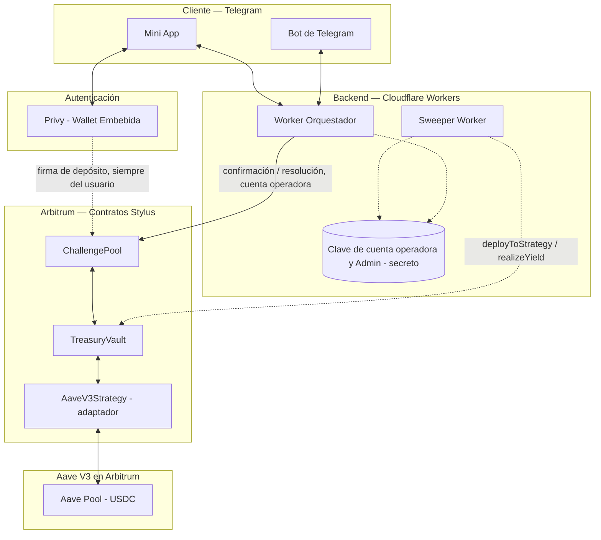
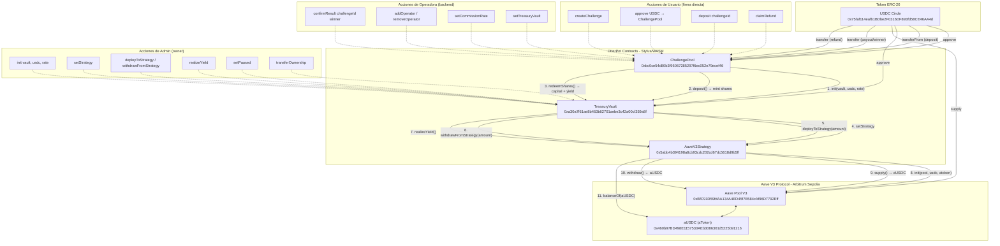
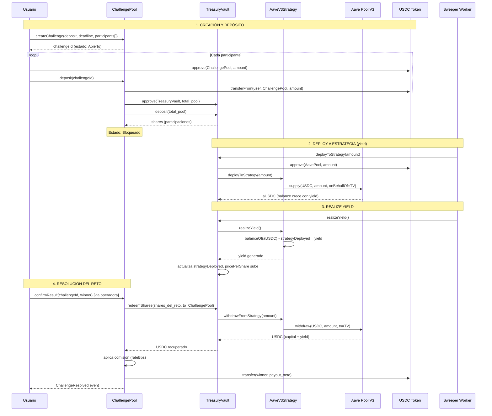
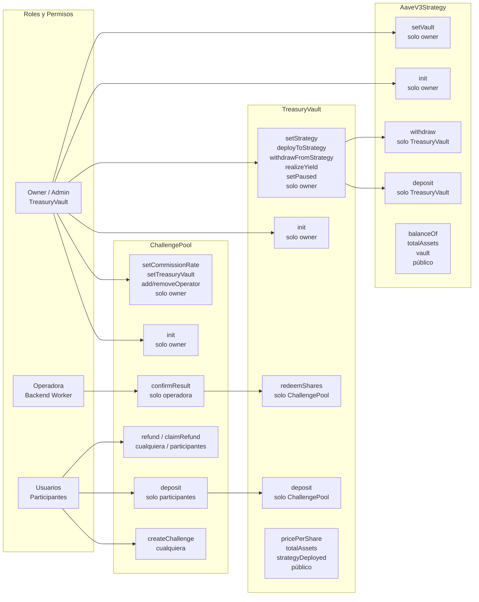
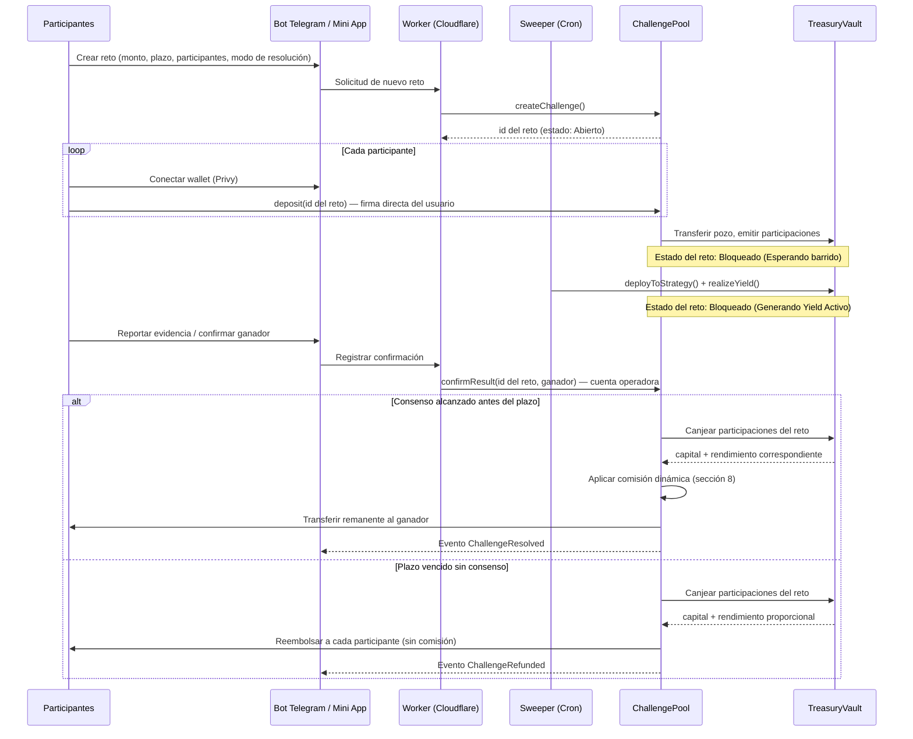
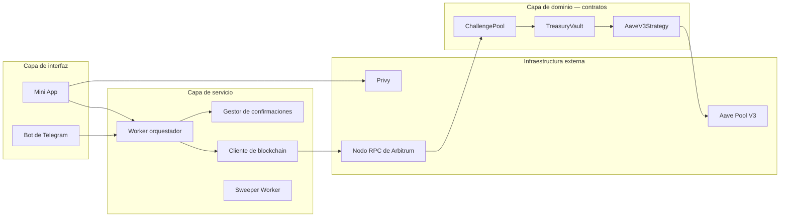
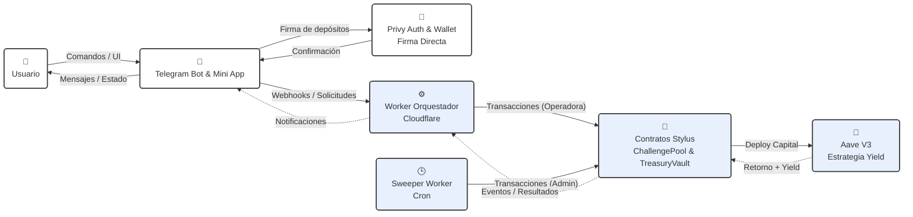

# Especificación de Diseño de Software (SDD)

## Proyecto "X" (nombre comercial pendiente) — Plataforma de retos entre amigos con pozo compartido en Arbitrum

| Campo | Valor |
| --- | --- |
| Track | Arbitrum — ETH Lima 2026 |
| Estado | v6 — alineado con la implementación actual de los contratos (ChallengePool, TreasuryVault, USDC testnet) |
| Base de este documento | Reunión de equipo del 4 ago 2026 + sesiones de diseño posteriores |
| Alcance de detalle | Documento de referencia para todo el equipo; profundidad técnica adicional en los módulos de Smart Contract y Backend |

---

## 1. Propósito y visión del producto

El proyecto es una infraestructura de retos con premio compartido, accesible enteramente desde Telegram, construida sobre Arbitrum. Un grupo de personas define un reto, cada participante deposita una cuota en un smart contract que actúa como custodio transparente del pozo, y al finalizar el reto el pozo se libera automáticamente al ganador según reglas de validación definidas de antemano.

La visión de largo plazo es que esta infraestructura sirva tanto para retos informales entre amigos (deporte, hábitos, retos creativos) como, en una fase posterior, para contextos más rigurosos como hackathons o comunidades grandes, mediante modos de resolución configurables.

## 2. Alcance

### 2.1 Dentro del alcance del MVP (4 días de desarrollo)

- Un smart contract en Stylus que gestiona múltiples retos de forma simultánea.
- Un caso de uso de validación completamente funcional: reto físico/deportivo con confirmación por consenso de participantes.
- Bot de Telegram con Mini App para crear retos, depositar, confirmar resultados y consultar el estado del pozo.
- Autenticación y wallet embebida mediante Privy.
- Modelo de comisión porcentual funcionando de extremo a extremo.
- Arquitectura de tesorería con contabilidad por participaciones, conectada a una implementación funcional real de una estrategia de rendimiento (sección 7.3), no solo a un mock.

### 2.2 Fuera del alcance del MVP (roadmap)

- Integración real con SDK de actividad física (Google Fit / Health Connect) — el MVP valida por evidencia y consenso, no por datos biométricos automatizados.
- Integración de cobro/off-ramp con El Dorado u otro proveedor de conversión a moneda local.
- Wallets inteligentes individuales por usuario (account abstraction completa).
- KYC para retos comunitarios grandes o de montos elevados.
- Modo "juez" para hackathons/comunidades, aunque el contrato lo soporta desde el diseño.
- Soporte multiplataforma más allá de Telegram.
- Estrategias de rendimiento adicionales a la definida en 7.3 (quedan como extensiones futuras del mismo adaptador).

## 3. Glosario

- **Reto (Challenge):** unidad básica del producto. Agrupa participantes, un monto de depósito, un plazo, un modo de resolución y un estado.
- **Pozo:** suma de los depósitos de todos los participantes de un reto.
- **Tesorería:** componente que agrupa el capital de todos los retos activos y lo coloca en una estrategia de generación de rendimiento.
- **Participación (share):** unidad contable interna de la Tesorería que representa la proporción de capital que le corresponde a un reto dentro del valor total de la Tesorería.
- **Estrategia de rendimiento (Yield Strategy):** implementación concreta que coloca el capital de la Tesorería en un protocolo externo de préstamos para generar rendimiento. Ver sección 7.3.
- **Operador:** dirección autorizada por el contrato para relayar confirmaciones ya verificadas off-chain, sin capacidad de mover fondos a direcciones arbitrarias.
- **Modo de resolución:** parámetro de un reto que determina si se resuelve por consenso automático de los participantes o por un juez designado.

## 4. Roles y responsabilidades del equipo

| Rol | Persona | Responsabilidad principal |
| --- | --- | --- |
| Pitch y presentación | William | Video pitch, narrativa de negocio, pitch deck |
| Landing, bot y orquestación | Julio | Landing page, bot de Telegram, backend en Cloudflare Workers |
| Backend y Smart Contract | Moises | Diseño e implementación del contrato en Stylus, lógica de tesorería y comisiones, integración del backend con el contrato |
| Frontend y auditoría de seguridad | Luishiño | Auditoría de seguridad del contrato, apoyo en frontend/Mini App según disponibilidad |

Este documento sirve como referencia común: cada módulo de la sección 6 en adelante indica qué rol lo implementa.

## 5. Arquitectura del sistema

### 5.1 Vista general de componentes

El sistema se compone de seis elementos principales que interactúan entre sí: el bot de Telegram con su Mini App como interfaz de usuario; Privy como capa de autenticación y wallet embebida; el backend orquestador en Cloudflare Workers; el Sweeper Worker automatizado (cron) para la gestión de tesorería; el contrato de Retos (ChallengePool) como custodio de cada pozo individual; y el contrato de Tesorería (TreasuryVault) como gestor del capital agregado y su colocación en la estrategia de rendimiento definida en la sección 7.3.

La interfaz de usuario no se comunica nunca directamente con la Tesorería ni con el Sweeper: toda interacción del usuario pasa por el contrato de Retos, que a su vez delega en la Tesorería el manejo del capital mientras un reto está activo.

### 5.2 Flujo principal (caso de uso ancla: reto deportivo)

Un participante crea un reto desde el bot, definiendo participantes, monto de depósito (en USDC) y plazo. Cada participante conecta su wallet vía Privy desde la Mini App, aprueba el monto de USDC necesario al contrato de Retos y deposita su cuota, quedando su fondo retenido. Cuando todos los participantes han depositado, el contrato mueve el pozo a la Tesorería y recibe a cambio participaciones equivalentes al valor depositado. Durante la duración del reto, la Tesorería mantiene ese capital (USDC) colocado en la estrategia de rendimiento definida en 7.3 junto con el capital de otros retos activos. Al vencer el plazo, los participantes confirman el resultado desde el bot; el backend cuenta las confirmaciones y, al alcanzar consenso, dispara la resolución en el contrato. El contrato de Retos canjea sus participaciones en la Tesorería, recibiendo el capital original más el rendimiento generado en USDC durante ese periodo, aplica la comisión correspondiente, y transfiere el remanente a la wallet del ganador. Todo el proceso queda registrado en eventos verificables en el explorador de bloques.

### 5.3 Diagrama de arquitectura general



### 5.3.1 Arquitectura detallada de contratos (Arbitrum Sepolia - Chain ID 421614)



### 5.3.2 Flujo de datos y ciclo de vida del capital



### 5.3.3 Diagrama de permisos y roles por contrato



### 5.4 Diagrama de secuencia — flujo núcleo de un reto



### 5.5 Diagrama de componentes



### 5.6 Diagrama de comunicación general



## 6. Especificación funcional — Módulo de Retos (ChallengePool)

**Implementado por:** Moises.

### 6.1 Responsabilidad del módulo

Gestionar el ciclo de vida completo de cada reto: creación, recepción de depósitos, registro de confirmaciones, resolución y, en caso necesario, cancelación o reembolso. Es el único punto de contacto entre los usuarios y sus fondos; nunca delega custodia directa a ningún otro componente salvo la Tesorería, y solo mientras el reto está en curso.

### 6.2 Modelo de datos (descriptivo)

Cada reto conserva: identificador único, dirección de quien lo creó, lista de participantes, monto de depósito requerido por participante, plazo de resolución, modo de resolución, dirección del juez (si aplica), estado actual, registro de quién ya depositó, registro de confirmaciones recibidas por posible ganador, número de participaciones de Tesorería asociadas al reto, y dirección del ganador una vez resuelto.

El contrato mantiene además, a nivel global, la lista de operadores autorizados y la dirección de la Tesorería con la que opera.

### 6.3 Ciclo de vida de un reto (estados)

1. **Abierto:** el reto fue creado y está a la espera de que todos los participantes depositen. Puede cancelarse libremente en este estado, ya que ningún fondo ha sido comprometido.
2. **Bloqueado:** todos los participantes depositaron. El pozo se transfiere a la Tesorería a cambio de participaciones. A partir de este punto ya no es posible cancelar; solo resolver o, si se cumple el plazo sin consenso, reembolsar.
3. **Resuelto:** se alcanzó un ganador válido. El contrato canjeó sus participaciones, aplicó la comisión y transfirió el remanente al ganador. Este es un estado final.
4. **Reembolsado:** venció el plazo sin que se alcanzara consenso o resolución por juez. El contrato canjea las participaciones y devuelve a cada participante su depósito original más la parte proporcional de rendimiento que le corresponde, sin cobrar comisión. Este es un estado final.

### 6.4 Modos de resolución

- **Auto-consenso:** pensado para retos informales entre amigos. El reto se resuelve automáticamente cuando una mayoría de participantes confirma al mismo ganador. Ningún actor externo interviene en la decisión.
- **Juez designado:** pensado para escalar a contextos más formales (hackathons, comunidades). Una única dirección designada al crear el reto tiene la potestad de resolver. Este modo queda especificado desde el diseño inicial del contrato, aunque el MVP solo demuestra el modo de auto-consenso.

> **Alineación con la implementación (MVP):** el ABI actual de `ChallengePool` no almacena un parámetro de modo de resolución ni una dirección de juez (`createChallenge(requiredDeposit, deadline, participants[])`). La confirmación del ganador se materializa on-chain mediante `confirmResult(challengeId, winner)`, restringida a la cuenta operadora (secciones 9 y 11), que retransmite el resultado ya consensuado/verificado off-chain por el grupo. Los modos de la sección 6.4 representan la intención de producto; su codificación explícita on-chain queda como evolución futura sin costo adicional en el MVP.

### 6.5 Requisitos de comportamiento

- Todo depósito se realiza utilizando el token ERC-20 USDC en la red Arbitrum. Por lo tanto, requiere que el usuario haya ejecutado previamente una transacción de `approve` al contrato de Retos.
- **Instancia de USDC:** en Arbitrum Sepolia se utiliza el USDC nativo de Circle en `0x75faf114eafb1BDbe2f0316DF893fd58CE46AA4d` (red de prueba; en Arbitrum One es `0xaf88d065e77c8cC2239327C5EDb3A432268e5831`). No está hardcodeado en el contrato: se inyecta por `USDC_ADDRESS` / `--usdc` y se fija en `init`. **La misma instancia** de USDC es la que mintea/instrumenta `TreasuryVault` y la que se usa como activo en la estrategia de rendimiento (sección 7.3). En el devnode Nitro local el USDC real no existe, por lo que se despliega un `MockUsdc` (solo local, nunca en testnet).
- Un depósito solo es válido si proviene de una dirección registrada como participante del reto, el usuario cuenta con el balance y la aprobación suficiente, y el monto transferido coincide exactamente con el monto requerido.
- Un reto solo pasa a estado Bloqueado cuando la totalidad de los participantes ha depositado.
- Una confirmación de resultado solo es válida si proviene de un participante del reto o de un operador autorizado relayando una confirmación verificada off-chain.
- El reembolso debe estar disponible sin condiciones adicionales una vez vencido el plazo sin resolución, como garantía de que ningún fondo quede bloqueado indefinidamente.
- Ninguna transferencia de fondos a una dirección distinta del ganador calculado por el propio contrato debe ser posible, incluyendo desde una cuenta operadora.

### 6.6 Nombres de funciones del contrato (ABI on-chain)

El contrato Stylus se escribe en Rust con funciones `snake_case` (p. ej. `create_challenge`, `challenge_status`), pero **el ABI on-chain emitido por `stylus-sdk` 0.8 cameliza esos nombres**. Por tanto, el Worker, la Mini App y cualquier integrador deben llamar las funciones por su nombre camelCase:

- `createChallenge(requiredDeposit, deadline, participants[])`
- `deposit(challengeId)`
- `confirmResult(challengeId, winner)`
- `refund(challengeId)` / `claimRefund(challengeId)`
- `challengeStatus(challengeId)` / `isOperator(address)` / `commissionRate()`
- `addOperator(address)` / `removeOperator(address)` / `setCommissionRate(rateBps)`
- `init(vault, usdc, commissionBps)`

El contrato no guarda parámetros de modo de resolución ni de juez: la resolución se determina por `confirmResult(challengeId, winner)`, que solo puede llamar una cuenta operadora (sección 9 y 11) retransmitiendo el resultado consensuado off-chain.

Esta regla aplica igualmente a `TreasuryVault` (§7), cuyo ABI real es: `init(usdc)`, `deposit(assets)`, `redeemShares(shares, to)`, `pricePerShare()`, `totalAssets()`, `totalShares()`, `strategyDeployed()`, `deployToStrategy(amount)`, `withdrawFromStrategy(amount)`, `withdrawAllFromStrategy()`, `realizeYield()` (sin argumentos: calcula el delta comparando el balance de la estrategia contra la última posición `strategyDeployed`), `setStrategy(strategy)`, `setPaused(bool)`, `transferOwnership(newOwner)`, `acceptOwnership()`, `strategy()`, `usdc()`, `pendingOwner()`.

## 7. Especificación funcional — Módulo de Tesorería (TreasuryVault)

**Implementado por:** Moises, con revisión de diseño conjunta con Luishiño por su impacto en la superficie de seguridad.

### 7.1 Responsabilidad del módulo

Agregar el capital proveniente de todos los retos activos, colocarlo en la estrategia de rendimiento definida en 7.3, y llevar una contabilidad justa y verificable de cuánto le corresponde a cada reto en el momento en que decide retirar su capital.

### 7.2 Modelo de contabilidad por participaciones

La Tesorería gestiona exclusivamente capital en USDC. No lleva un registro de "cuánto generó cada día" repartido entre los retos activos ese día. En su lugar, funciona como un vault de participaciones: al recibir el capital (en USDC) de un reto, emite participaciones calculadas al precio vigente, definido como el valor total de la Tesorería (incluyendo el rendimiento en USDC) dividido entre el total de participaciones en circulación. A medida que la estrategia de rendimiento genera interés, el valor total de la Tesorería aumenta mientras el número de participaciones permanece constante, de modo que cada participación incrementa su valor de forma uniforme para todos sus tenedores. Cuando un reto se resuelve o se reembolsa, canjea exactamente sus propias participaciones, recibiendo su capital original más el rendimiento generado en USDC específicamente por ese capital durante el tiempo que estuvo depositado.

Esta mecánica garantiza que ningún reto obtiene una ventaja o desventaja por el tamaño de la Tesorería en el momento en que resuelve, ni por la cantidad de otros retos corriendo en paralelo. El rendimiento que le corresponde a cada reto depende únicamente de su propio capital, del tiempo que estuvo depositado y de la tasa de rendimiento vigente del mercado — no de una asignación arbitraria entre retos concurrentes.

### 7.3 Estrategia de rendimiento — interfaz, implementación concreta y gobernanza

Esta sección fija de forma explícita qué se construye para el MVP. La versión anterior de este documento describía "un protocolo externo" sin nombrar uno — eso dejó una decisión de implementación abierta que un flujo de Spec-Driven Development no puede resolver por sí solo, y llevó a construir mocks en lugar de una integración real. A partir de esta versión, el protocolo concreto queda definido y es de cumplimiento obligatorio para el MVP; el carácter "agnóstico" se preserva a nivel de interfaz, no dejando la elección abierta en tiempo de desarrollo.

**7.3.1 Interfaz genérica del adaptador**

La Tesorería nunca llama directamente a un protocolo externo. Se comunica exclusivamente con una interfaz fija, `YieldStrategy` (en el código: `IStrategy`, módulo `strategy/mod.rs`), cuyas operaciones son: depositar un monto de USDC en la estrategia (`deposit(uint256)`), retirar un monto de USDC de la estrategia (`withdraw(uint256) returns (uint256)`), y consultar el valor total en USDC que la Tesorería tiene colocado (`balanceOf()`), además de `totalAssets()` como lectura auxiliar del valor bajo gestión. Cualquier implementación de esta interfaz es intercambiable sin modificar la lógica de contabilidad por participaciones descrita en 7.2.

**7.3.2 Implementación concreta del MVP: Aave V3**

El protocolo definido para el MVP es **Aave V3**, en su mercado de Arbitrum. Se eligió por tres razones: es el protocolo de préstamos más auditado y con mayor liquidez histórica en Arbitrum; expone exactamente las dos operaciones que necesita el adaptador (`supply` y `withdraw`) sin superficie adicional que integrar; y su despliegue en testnet está documentado públicamente (aave-address-book de la Fundación Aave), lo que permite verificar direcciones y desarrollar contra la red real sin ambigüedad.

| Parámetro | Valor |
| --- | --- |
| Contrato | Aave Pool V3 |
| Dirección (Arbitrum One) | `0x794a61358D6845594F94dc1DB02A252b5b4814aD` |
| Dirección (Arbitrum Sepolia) | `0xBfC91D59fdAA134A4ED45f7B584cAf96D7792Eff` |
| Activo | USDC (la misma instancia que usa `ChallengePool`): en Arbitrum Sepolia es el USDC de Circle en `0x75faf114eafb1BDbe2f0316DF893fd58CE46AA4d`; en Arbitrum One, `0xaf88d065e77c8cC2239327C5EDb3A432268e5831`. El adaptador nunca supone una dirección hardcodeada de token: opera sobre la dirección de USDC fijada en `TreasuryVault.init(usdc)` |
| Función de depósito | `supply(address asset, uint256 amount, address onBehalfOf, uint16 referralCode)` — la Tesorería llama con `onBehalfOf = address(this)` y `referralCode = 0` |
| Función de retiro | `withdraw(address asset, uint256 amount, address to) returns (uint256)` |
| Consulta del token de rendimiento | `getReserveAToken(address asset) returns (address)` — devuelve la dirección del aToken (aUSDC) asociado; no se hardcodea, se consulta en tiempo real |
| Valor total colocado | Balance de aUSDC de la Tesorería (`balanceOf(address(this))` sobre el aToken) — el balance de aUSDC crece automáticamente con el rendimiento, sin necesidad de una llamada adicional |
| Requisito previo | La Tesorería debe ejecutar `approve` del USDC hacia el Pool antes de la primera llamada a `supply` |

El adaptador `AaveV3Strategy` implementa la interfaz `YieldStrategy` de 7.3.1 llamando exclusivamente a estas dos funciones de escritura y a la consulta del aToken; no implementa ninguna otra función del Pool de Aave (no se usa `borrow`, `repay`, ni ninguna función de gestión de colateral, ya que la Tesorería nunca solicita préstamos).

**Entorno de pruebas:** Arbitrum Sepolia cuenta con USDC de prueba obtenible desde el faucet de Circle (`faucet.circle.com`) o desde el faucet propio de Aave para ese mercado (`bridge-testnet.aave.com/faucet/?marketName=proto_arbitrum_sepolia_v3`), lo que permite probar el ciclo completo de depósito y retiro contra el Aave Pool real en testnet, no contra un simulacro.

**7.3.3 Implementaciones de prueba (Mock)**

Además de `AaveV3Strategy`, debe existir un `MockYieldStrategy` que implemente la misma interfaz `YieldStrategy` con una tasa de rendimiento simulada y determinística. Su único propósito es permitir pruebas unitarias rápidas de `TreasuryVault` sin depender de una red ni de tiempo real transcurrido. **No es un entregable de la hackathon ni un sustituto de 7.3.2**: la demo y el despliegue final deben usar `AaveV3Strategy`.

Complementariamente, existe un `MockUsdc` (ERC-20 con `mint`) que se despliega **solo** en el devnode Nitro local, donde el USDC real no existe. Nunca se usa en testnet ni en producción: en Arbitrum Sepolia se opera con el USDC de Circle (sección 6.5) y los scripts de integración reciben su dirección por `USDC_ADDRESS` / `--usdc`.

El adaptador que consume `TreasuryVault` expone la interfaz `IStrategy` con `deposit(uint256)`, `withdraw(uint256) returns (uint256)`, `balanceOf()` y `totalAssets()` (módulo `strategy/mod.rs`); esta interfaz es la que deben implementar tanto `AaveV3Strategy` como `MockYieldStrategy` en su corrección posterior (secciones 7.3.1 y 7.3.2).

**7.3.4 Gobernanza del cambio de estrategia**

Dado que se trata de fondos de terceros, sustituir `AaveV3Strategy` por otra implementación de `YieldStrategy` (por ejemplo, si en el futuro se evalúa otro protocolo con mejores condiciones) requiere aprobación explícita de una cuenta administradora multifirma del equipo, mediante `setStrategy(strategy)`. Ninguna estrategia se activa automáticamente por ofrecer una tasa más alta, para evitar exponer fondos de usuarios a protocolos insuficientemente evaluados. Para el MVP de la hackathon, `AaveV3Strategy` es la única estrategia que se implementa y despliega.

### 7.4 Consideración de magnitud

Para retos de corta duración (horas) y montos pequeños, el rendimiento generado en términos absolutos será mínimo, dado que las tasas de rendimiento son anuales por naturaleza. El valor económico real de este módulo se materializa con volumen (muchos retos concurrentes sostenidos en el tiempo) y con retos de mayor duración (semanas o meses, como los casos de ahorro o cumplimiento de metas). El módulo debe construirse y demostrarse funcionando end-to-end contra Aave V3 en Arbitrum Sepolia durante el MVP, sin que su rendimiento económico dependa de mostrarse significativo en términos de monto durante la ventana de la hackathon — lo que se demuestra es que el flujo de depósito, generación de rendimiento y retiro ocurre realmente contra un protocolo externo real, no que el monto generado sea grande.

## 8. Especificación funcional — Modelo de comisiones

**Implementado por:** Moises.

### 8.1 Comisión base (objetivo)

Cada reto resuelto con éxito paga una comisión sobre el valor recuperado de la Tesorería. La **comisión objetivo** se calcula sobre el **pozo** (la suma de depósitos original del reto: `required_deposit × participant_count`), no sobre el monto recuperado ni sobre una porción arbitraria. El porcentaje es un parámetro configurable del contrato, ajustable únicamente por la cuenta administradora en cualquier momento después del despliegue mediante la función `setCommissionRate(rateBps)`. Cada cambio emite el evento `CommissionRateUpdated(previousRate, newRate)` para garantizar trazabilidad on-chain. La tasa activa en el momento de la resolución es la que se aplica, independientemente de la tasa vigente cuando el reto fue creado o financiado.

La lógica del contrato asegura que la comisión efectiva nunca supere el pozo, y permite fijar la tasa en 0 bps (0 %) para absorber el costo operativo temporalmente (ej. campañas de adopción). Valores muy altos (hasta 10.000 bps o 100 %) son posibles en el límite pero disuadirían a los usuarios de participar.

### 8.2 Modelo de comisión dinámica cubierto por rendimiento

El modelo es **dinámico**: el rendimiento generado por el staking (el yield atribuible a ese reto) se aplica **primero** para cubrir la comisión, y la plataforma solo retiene aquello que el yield no alcanza a cubrir. Al resolver, el reto redime sus participaciones en la Tesorería (sección 7.2) y distingue:

- **principal (pozo):** `required_deposit × participant_count` — lo depositado.
- **recuperado (recovered):** lo que devuelve la Tesorería al redimir = principal + rendimiento.
- **yield:** `recuperado − principal`, el rendimiento atribuible a ese reto (justo vía `price_per_share`, sección 7.2).

Con la tasa objetivo de la sección 8.1 sobre el pozo:

```
comisión_objetivo = pozo × rateBps / 10 000
fee_plataforma     = max(comisión_objetivo − yield, 0)   // lo no cubierto por el staking
pago_al_ganador    = recuperado − fee_plataforma
```

Casos:

- **Sin staking activo (`yield = 0`, situación actual):** `fee_plataforma = comisión_objetivo` y `pago_al_ganador = recuperado − comisión_objetivo`. Se comporta como una comisión plana sobre el pozo.
- **El staking cubre parte o toda la comisión (`yield ≥ comisión_objetivo`):** `fee_plataforma = 0` y el ganador recibe la totalidad (`principal + yield`). El **excedente de rendimiento sobre la comisión se convierte en bono para el ganador**: no se redirige a ninguna wallet de plataforma ni a la Tesorería (decisión del MVP), lo que además conserva la invariante de la sección 11 de que ningún operador pueda mover fondos a direcciones arbitrarias.

Este modelo solo modifica la **cantidad** que se abona al ganador (`winner_payout`); no requiere movimientos de fondos nuevos. La comisión efectiva (`fee_plataforma`) se registra en el evento `ChallengeResolved`; en el MVP no existe un mecanismo de cobro de la plataforma (permanece como USDC ocioso en `ChallengePool`). La recolección de ingresos de la plataforma queda fuera del alcance del contrato y se gestionará mediante un cambio Spec-Driven con un mecanismo de cobro restringido.

### 8.3 Reembolsos

Los retos reembolsados no pagan comisión. El capital devuelto a cada participante incluye la parte proporcional de rendimiento que le corresponde según su participación en la Tesorería durante el periodo en que estuvo depositado.

## 9. Especificación funcional — Backend (Cloudflare Workers)

**Implementado por:** Julio, con integración de las funciones del contrato provista por Moises.

El backend actúa como orquestador entre la interfaz de Telegram y el contrato de Retos. Sus responsabilidades son: recibir y procesar comandos del bot para crear retos e invitar participantes; verificar la identidad del usuario mediante su sesión de Privy antes de aceptar una confirmación de resultado; mantener el estado intermedio de confirmaciones recibidas por reto hasta alcanzar el umbral de consenso definido; construir y enviar las transacciones de resolución al contrato cuando corresponda, utilizando una cuenta operadora dedicada cuya clave se mantiene como secreto gestionado por la plataforma, nunca expuesta en código; y consultar el estado del contrato para informar al grupo de Telegram sobre el progreso del reto.

El backend no tiene, en ningún caso, la capacidad de dirigir fondos a una dirección distinta del ganador determinado por el contrato.

### 9.1 Sweeper Worker (Automatización de Tesorería)

Para automatizar el despliegue de fondos inactivos hacia la estrategia de rendimiento (Aave) sin comprometer la seguridad, se utiliza un Worker independiente (`packages/sweeper`). Este componente tiene responsabilidades estrictamente separadas del bot:

- **Ejecución basada en Cron:** No expone rutas HTTP públicas. Se activa exclusivamente mediante un trigger cron de Cloudflare (por defecto cada 12 horas).
- **Aislamiento de Llaves:** Utiliza la llave privada del administrador (`ADMIN_PRIVATE_KEY`), la cual se inyecta como secreto y nunca coexiste con el entorno del bot. Esto asegura que una vulnerabilidad en el bot público no exponga el control de la tesorería.
- **Política de Barrido:** Lee el balance inactivo en USDC del `TreasuryVault` y, si supera un umbral configurable (ej. 10 USDC), ejecuta `deployToStrategy` seguido de `realizeYield` para actualizar la contabilidad de participaciones.

## 10. Especificación funcional — Bot de Telegram y Mini App

**Implementado por:** Julio (bot) y Luishiño (apoyo de frontend en la Mini App).

La interfaz completa del producto vive dentro de Telegram, sin requerir instalación de una aplicación externa. El bot gestiona los comandos conversacionales de creación de retos y confirmaciones. La Mini App, embebida dentro de Telegram, gestiona la conexión de wallet mediante Privy, la visualización del estado del pozo y del historial de retos del usuario, y el flujo de depósito, que siempre requiere la firma directa del usuario.

## 11. Seguridad y permisos

**Responsable de auditoría:** Luishiño.

El sistema distingue explícitamente entre acciones que requieren firma directa del usuario y acciones que puede relayar una cuenta operadora del backend. El depósito de fondos siempre requiere firma directa del usuario. La confirmación de resultado puede ser relayada por un operador, pero únicamente como transmisión de una decisión que el usuario ya expresó de forma verificable fuera de la cadena; en ningún caso un operador puede iniciar una transferencia de fondos hacia una dirección distinta de la calculada internamente por el contrato como ganador.

El contrato sigue el patrón de actualizar su estado interno antes de ejecutar cualquier transferencia externa, para prevenir ataques de reentrada. Se establece un monto máximo de depósito por participante como mitigación ante el riesgo de retos con montos desproporcionados. El cambio de estrategia de rendimiento de la Tesorería requiere aprobación administrativa explícita, según lo especificado en la sección 7.3.4. Adicionalmente, dado que `AaveV3Strategy` interactúa con un protocolo externo, la auditoría debe verificar explícitamente que el adaptador solo puede llamar `supply`, `withdraw` y `getReserveAToken` sobre el Pool de Aave, y ninguna otra función (en particular, que no pueda usarse para abrir posiciones de préstamo o exponer la Tesorería a liquidación).

## 12. Off-ramp a moneda fiat

El contrato de Retos no participa en la conversión de fondos a moneda local: su responsabilidad termina al transferir el pozo a la wallet del ganador. El MVP asume que el usuario gestiona el retiro de sus fondos hacia un exchange de su preferencia a través de la red Arbitrum. Una integración con un proveedor de conversión a moneda local queda documentada como línea de desarrollo posterior, sin dependencias técnicas sobre el contrato actual.

## 13. Requisitos no funcionales

- **Transparencia:** toda operación de creación, depósito, confirmación, resolución y reembolso debe emitir un evento verificable públicamente en el explorador de bloques de Arbitrum.
- **Disponibilidad de fondos:** ningún fondo depositado debe poder quedar bloqueado de forma permanente; el mecanismo de reembolso debe estar garantizado ante cualquier escenario de falta de consenso, incluyendo si `AaveV3Strategy` no puede retirar por falta de liquidez momentánea del Pool (caso extremo a documentar como riesgo conocido, ver sección 15).
- **Costo de transacción:** el costo real de gas debe medirse en despliegues de prueba en Arbitrum Sepolia antes de fijar el porcentaje de comisión mínimo viable, dado que no existe una cifra de referencia universal aplicable.
- **Auditabilidad:** la superficie de ataque del sistema (en particular, los permisos otorgados a cuentas operadoras, la gobernanza de la Tesorería y el alcance exacto de las llamadas de `AaveV3Strategy` al Pool de Aave) debe quedar documentada de forma explícita para facilitar la revisión de seguridad dentro del tiempo disponible.

## 14. Plan de trabajo por rol

- **Moises (Backend y Smart Contract):** especificación y desarrollo del contrato de Retos y del contrato de Tesorería, implementación de `AaveV3Strategy` y `MockYieldStrategy` conforme a 7.3, definición del modelo de comisiones, integración de las funciones del contrato con el backend de Cloudflare Workers, despliegue en Arbitrum Sepolia.
- **Julio (Landing, bot y Cloudflare Workers):** desarrollo de la landing informativa, del bot de Telegram, del backend orquestador y del Sweeper automatizado, incluyendo la gestión de cuentas operadoras/admin y su integración con los contratos.
- **Luishiño (Auditoría y Frontend):** auditoría de seguridad del contrato conforme a la sección 11, con atención específica al alcance de `AaveV3Strategy` (7.3.2); apoyo en el desarrollo de la Mini App de Telegram según disponibilidad de tiempo.
- **William (Pitch):** desarrollo del video pitch y del pitch deck, incorporando la narrativa de negocio actualizada (custodia transparente y caso cross-border como argumentos centrales, integración real con Aave V3 como evidencia de implementación funcional, no solo conceptual).

## 15. Riesgos y mitigaciones

| Riesgo | Mitigación |
| --- | --- |
| El rendimiento generado durante la hackathon es insuficiente para demostrarse en vivo en términos de monto | Demostrar la comisión porcentual como mecanismo principal de negocio; demostrar el flujo completo contra Aave V3 en testnet como evidencia de integración real, independientemente del monto generado |
| Falta de liquidez momentánea en el Pool de Aave impide un `withdraw` completo | Documentar como riesgo conocido; para el MVP, el monto máximo de depósito por participante (sección 11) mantiene la exposición baja frente a la liquidez típica del mercado de USDC en Aave Arbitrum |
| Tiempo de aprendizaje de Stylus o de la integración cross-contract con Aave | Empezar la integración de `AaveV3Strategy` en un contrato aislado y probado de forma independiente antes de conectarlo a `TreasuryVault`, siguiendo el plan de trabajo de la sección 14 |
| Validación de resultados no completamente objetiva en el modo auto-consenso | Documentar esta limitación de forma transparente como decisión de diseño consciente para el MVP |

## 16. Historial de cambios del documento

- **v1:** propuesta inicial de arquitectura, roles y casos de uso.
- **v2:** incorpora el modelo de Tesorería por participaciones, el modelo de comisión dinámica cubierta por rendimiento, la corrección sobre comisiones bancarias en Perú, y la actualización de roles del equipo.
- **v3:** se migró a la implementación final en Rust (Stylus) con el contrato `ChallengePool` real. El pozo retiene todo el yield acumulado sobre el capital. La comisión base se cobra sobre el 100% del valor recuperado para costear el orquestador off-chain.
- **v4:** comisión configurable post-despliegue: evento `CommissionRateUpdated`, vista `commissionRate()`, script `set-rate.ts`, y prueba de integración con cambio de tasa.
- **v5:** define la implementación concreta y obligatoria de la estrategia de rendimiento — Aave V3 en Arbitrum (direcciones distintas en mainnet y Sepolia según aave-address-book), con las funciones exactas usadas (`supply`, `withdraw`, `getReserveAToken`), el rol de `MockYieldStrategy` acotado exclusivamente a pruebas unitarias, y la gobernanza de cambio de estrategia (secciones 7.3 y 11).
- **v6 (actual):** alineación del documento con el código real de los contratos. Se corrige el ABI de `TreasuryVault` (`realizeYield()` sin argumentos y funciones de gobernanza/estrategia que faltaban), se aclara que el ABI de `ChallengePool` no incorpora modo de resolución/juez (la resolución la cierra `confirmResult` del operador), se fija la instancia exacta de USDC usada en testnet (Circle, Arbitrum Sepolia `0x75faf114eafb1BDbe2f0316DF893fd58CE46AA4d`) como el mismo activo de `ChallengePool`, `TreasuryVault` y la estrategia de rendimiento, y se **restaura explícitamente el modelo de comisión dinámica cubierto por rendimiento** (sección 8.2): con `yield = 0` se comporta como comisión plana sobre el pozo, y si el staking supera a la comisión, el excedente es un bono para el ganador (política elegida para el MVP, sin recolección de ingresos de plataforma). La implementación de este modelo se realizará como cambio Spec-Driven (OpenSpec), no sobre el código actual. Adicionalmente, incluye el modelo de arquitectura completa con el Sweeper Worker (secciones 5.3-5.6 y 9.1).
