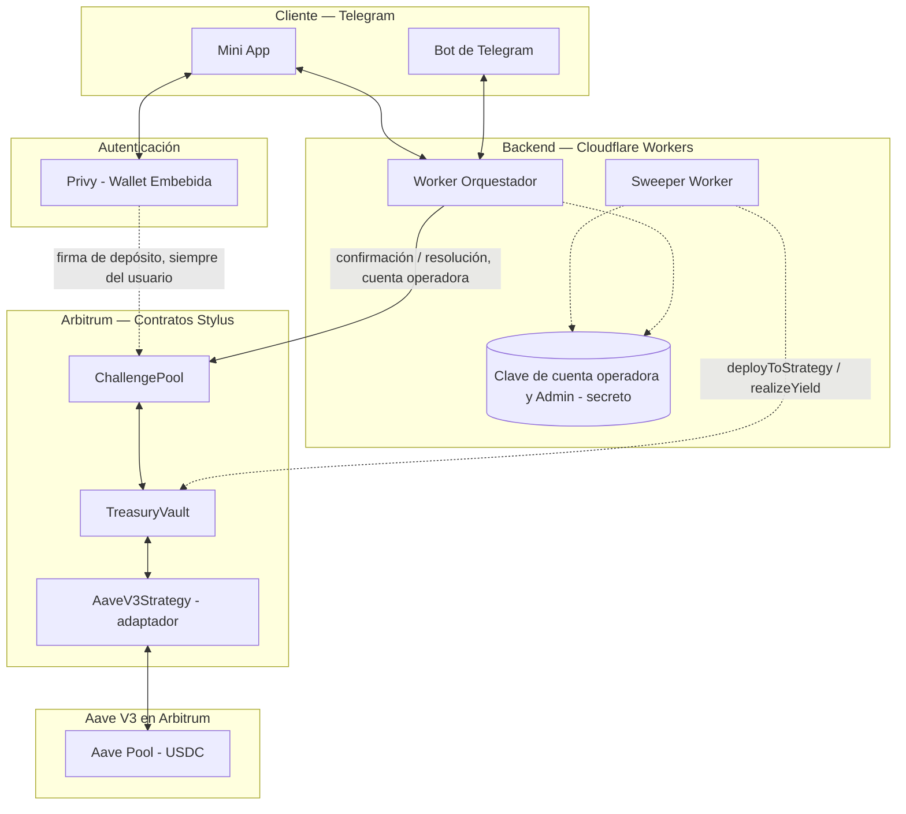
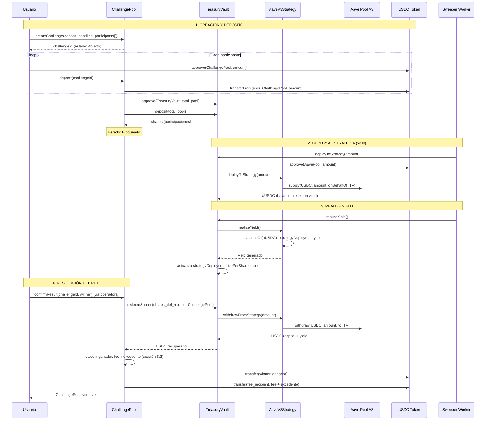
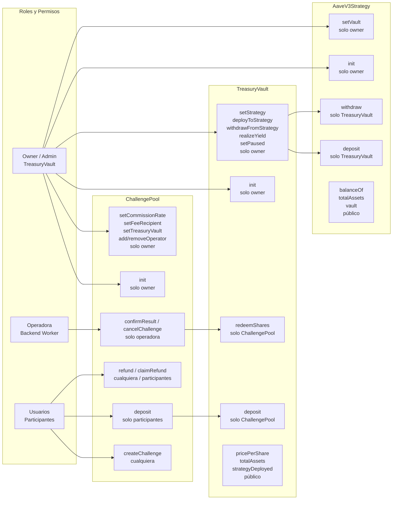
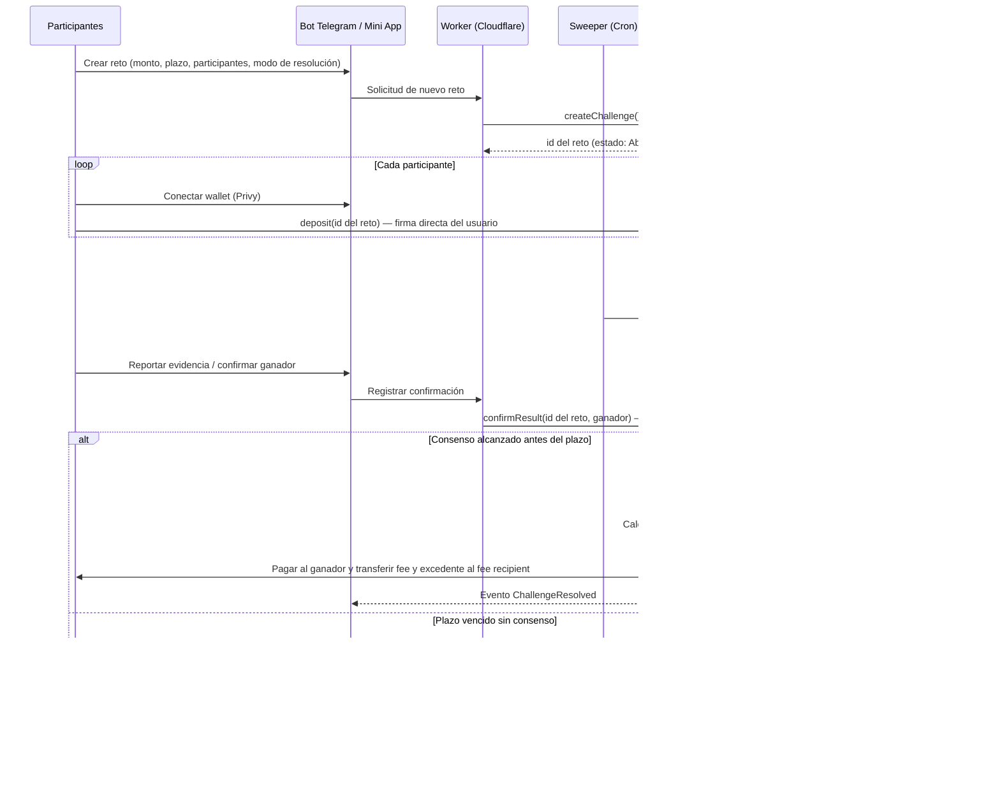
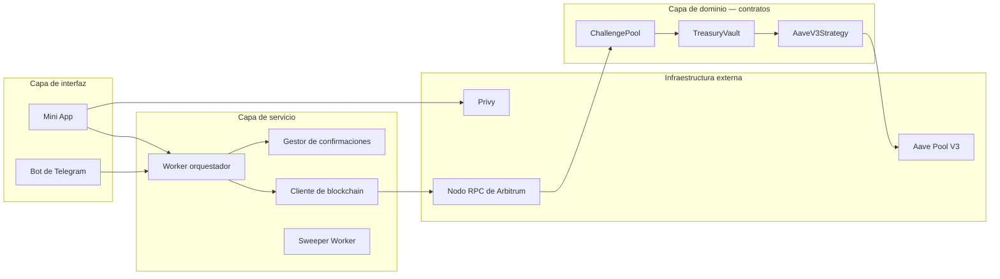
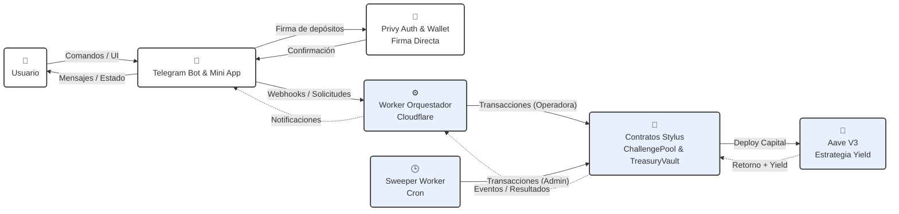

# Especificación de Diseño de Software (SDD)

## Proyecto "X" (nombre comercial pendiente) — Plataforma de retos entre amigos con pozo compartido en Arbitrum

| Campo | Valor |
| --- | --- |
| Track | Arbitrum Open House Singapore (el proyecto nació en ETH Lima 2026) |
| Estado | v8 — modelo de pago con comisión objetivo y excedente al fee recipient, tope de comisión, validación del roster, cancelación en Abierto, acreditación de rendimiento en la Tesorería, relayer confiable y política del Sweeper |
| Implementación | Este documento describe el comportamiento objetivo de la v8. La sección 17 indica qué está implementado y qué está pendiente, con su issue del milestone ArbitrumSingapur |
| Decisiones de diseño | [`DESIGN_DECISIONS.md`](DESIGN_DECISIONS.md) (DD-01 a DD-10) |
| Alcance de detalle | Documento de referencia para todo el equipo; profundidad técnica adicional en los módulos de Smart Contract y Backend |

---

## 1. Propósito y visión del producto

El proyecto es una infraestructura de retos con premio compartido, accesible enteramente desde Telegram, construida sobre Arbitrum. Un grupo de personas define un reto, cada participante deposita una cuota en un smart contract que actúa como custodio transparente del pozo, y al finalizar el reto el pozo se libera automáticamente al ganador según reglas de validación definidas de antemano.

La visión de largo plazo es que esta infraestructura sirva tanto para retos informales entre amigos (deporte, hábitos, retos creativos) como, en una fase posterior, para contextos más rigurosos como hackathons o comunidades grandes, mediante modos de resolución configurables.

## 2. Alcance

### 2.1 Dentro del alcance del MVP

La definición del MVP, sus fases y sus criterios de entrega están en [`ROADMAP.md`](ROADMAP.md). Dentro del alcance:

- Un smart contract en Stylus que gestiona múltiples retos de forma simultánea.
- Un caso de uso de validación completamente funcional: reto físico/deportivo con confirmación por consenso de participantes.
- Bot de Telegram con una página de depósito (Mini App) para crear retos, depositar, confirmar resultados y consultar el estado del pozo.
- Modelo de comisión porcentual funcionando de extremo a extremo, con **recolección directa en el fee recipient de la plataforma** (sección 8.2).
- Validación del roster al crear un reto (sección 6.2).
- Cancelación de retos en estado Abierto y **reembolso en Abierto post-plazo** como red de seguridad (sección 6.3).
- Arquitectura de tesorería con contabilidad por participaciones, conectada a una implementación funcional real de una estrategia de rendimiento (sección 7.3), no solo a un mock, con el rendimiento acreditado en cada depósito y canje (sección 7.2).
- Relayer confiable: consenso persistente, recibo de transacción confirmado y una sola configuración de cadena (sección 9.2).

### 2.2 Fuera del alcance del MVP (roadmap)

- Integración real con SDK de actividad física (Google Fit / Health Connect) — el MVP valida por evidencia y consenso, no por datos biométricos automatizados.
- Integración de cobro/off-ramp con El Dorado u otro proveedor de conversión a moneda local.
- Wallets inteligentes individuales por usuario (account abstraction completa).
- KYC para retos comunitarios grandes o de montos elevados.
- Modo "juez" para hackathons/comunidades, aunque el contrato lo soporta desde el diseño.
- Autenticación y wallet embebida mediante Privy: para el MVP se entregan maquetas del flujo; la integración completa es roadmap.
- Ventana de veto sobre el resultado y agente de IA que proponga el veredicto.
- Retos de colecta (destino externo a los participantes).
- Soporte multiplataforma más allá de Telegram.
- Estrategias de rendimiento adicionales a la definida en 7.3 (quedan como extensiones futuras del mismo adaptador).

## 3. Glosario

- **Reto (Challenge):** unidad básica del producto. Agrupa participantes, un monto de depósito, un plazo, un modo de resolución y un estado.
- **Pozo:** suma de los depósitos de todos los participantes de un reto.
- **Tesorería:** componente que agrupa el capital de todos los retos activos y lo coloca en una estrategia de generación de rendimiento.
- **Participación (share):** unidad contable interna de la Tesorería que representa la proporción de capital que le corresponde a un reto dentro del valor total de la Tesorería.
- **Estrategia de rendimiento (Yield Strategy):** implementación concreta que coloca el capital de la Tesorería en un protocolo externo de préstamos para generar rendimiento. Ver sección 7.3.
- **Operador:** dirección autorizada por el contrato para relayar confirmaciones ya verificadas off-chain, sin capacidad de mover fondos a direcciones arbitrarias.
- **Relayer:** componente del Worker que cuenta los votos de Telegram y, al alcanzarse el consenso, firma con la cuenta operadora y envía `confirmResult` al contrato (sección 9.2).
- **Fee recipient:** dirección que recibe la comisión de la plataforma y el excedente de rendimiento de cada reto resuelto (sección 8.2).
- **Excedente:** parte de lo recuperado de la Tesorería que sobra después de pagar al ganador y la comisión (sección 8.2).
- **Modo de resolución:** parámetro de un reto que determina si se resuelve por consenso automático de los participantes o por un juez designado.

## 4. Roles y responsabilidades del equipo

| Rol | Persona | Responsabilidad principal |
| --- | --- | --- |
| Negocio, demo y pitch | William | Narrativa de negocio, demo, video pitch y pitch deck |
| Bot de Telegram y relayer | Julio | Bot de Telegram, Worker orquestador (relayer) y su integración con los contratos |
| Contratos | Moises | Diseño e implementación de los contratos en Stylus, lógica de tesorería y comisiones, despliegue |
| Frontend | Fernando | Interfaz: landing y pantallas del flujo de depósito |
| Seguridad y Mini App | Luishiño | Revisión de seguridad de los contratos, Sweeper (clave de administrador) y Mini App de Telegram |

Este documento sirve como referencia común: cada módulo de la sección 6 en adelante indica qué rol lo implementa.

## 5. Arquitectura del sistema

### 5.1 Vista general de componentes

El sistema se compone de seis elementos principales que interactúan entre sí: el bot de Telegram con su página de depósito (Mini App) como interfaz de usuario; Privy como capa de autenticación y wallet embebida (roadmap para el MVP, sección 2.2); el backend orquestador en Cloudflare Workers; el Sweeper Worker automatizado (cron) para la gestión de tesorería; el contrato de Retos (ChallengePool) como custodio de cada pozo individual; y el contrato de Tesorería (TreasuryVault) como gestor del capital agregado y su colocación en la estrategia de rendimiento definida en la sección 7.3.

La interfaz de usuario no se comunica nunca directamente con la Tesorería ni con el Sweeper: toda interacción del usuario pasa por el contrato de Retos, que a su vez delega en la Tesorería el manejo del capital mientras un reto está activo.

### 5.2 Flujo principal (caso de uso ancla: reto deportivo)

Un participante crea un reto desde el bot, definiendo participantes, monto de depósito (en USDC) y plazo. Cada participante conecta su wallet desde la página de depósito (con Privy en el roadmap), aprueba el monto de USDC necesario al contrato de Retos y deposita su cuota, quedando su fondo retenido. Cuando todos los participantes han depositado, el contrato mueve el pozo a la Tesorería y recibe a cambio participaciones equivalentes al valor depositado. Durante la duración del reto, la Tesorería mantiene ese capital (USDC) colocado en la estrategia de rendimiento definida en 7.3 junto con el capital de otros retos activos. Al vencer el plazo, los participantes confirman el resultado desde el bot; el backend cuenta las confirmaciones y, al alcanzar consenso, dispara la resolución en el contrato. El contrato de Retos canjea sus participaciones en la Tesorería, recibiendo el capital original más el rendimiento generado en USDC durante ese periodo, calcula el pago según la sección 8.2, paga al ganador y transfiere la comisión y el excedente al fee recipient. Todo el proceso queda registrado en eventos verificables en el explorador de bloques.

### 5.3 Diagrama de arquitectura general


```mermaid
graph TB
    subgraph Cliente["Cliente — Telegram"]
        TGBot[Bot de Telegram]
        MiniApp[Mini App]
    end

    subgraph Auth["Autenticación"]
        Privy[Privy - Wallet Embebida]
    end

    subgraph Backend["Backend — Cloudflare Workers"]
        Worker[Worker Orquestador]
        Sweeper[Sweeper Worker]
        Secrets[(Clave de cuenta operadora y Admin - secreto)]
    end

    subgraph Chain["Arbitrum — Contratos Stylus"]
        CP[ChallengePool]
        TV[TreasuryVault]
        YS[AaveV3Strategy - adaptador]
    end

    subgraph External["Aave V3 en Arbitrum"]
        Pool[Aave Pool - USDC]
    end

    TGBot <--> Worker
    MiniApp <--> Privy
    MiniApp <--> Worker
    Privy -.->|firma de depósito, siempre del usuario| CP
    Worker -->|confirmación / resolución, cuenta operadora| CP
    Sweeper -.->|deployToStrategy / realizeYield| TV
    Worker -.-> Secrets
    Sweeper -.-> Secrets
    CP <--> TV
    TV <--> YS
    YS <--> Pool
```

### 5.3.1 Arquitectura detallada de contratos (Arbitrum Sepolia - Chain ID 421614)

> Las direcciones del diagrama corresponden al despliegue vigente. La v8 se despliega de una sola vez (`DESIGN_DECISIONS.md`, DD-09) y sus direcciones se publican al completarse el despliegue (#24).


```mermaid
graph TB
    subgraph USDCToken["Token ERC-20"]
        USDC[USDC Circle<br/>0x75faf114eafb1BDbe2F0316DF893fd58CE46AA4d]
    end

    subgraph AaveV3["Aave V3 Protocol - Arbitrum Sepolia"]
        AAVE_POOL[Aave Pool V3<br/>0xBfC91D59fdAA134A4ED45f7B584cAf96D7792Eff]
        A_USDC["aUSDC (aToken)<br/>0x460b97BD498E1157530AEb3086301d5225b91216"]
    end

    subgraph OtterPot["OtterPot Contracts - Stylus/WASM"]
        CP[ChallengePool<br/>0xbc0ce54d80b3f95067285297f6ec052e79ecef46]
        TV[TreasuryVault<br/>0xa30a7f61ae8b463b62701aebe3c42a00cf359a8f]
        AS[AaveV3Strategy<br/>0x5abb4b394198a8cb93cdc202cd67dc5618d9b5ff]
    end

    subgraph UserActions["Acciones de Usuario (firma directa)"]
        U1[createChallenge]
        U2[approve USDC → ChallengePool]
        U3[deposit challengeId]
        U4[claimRefund]
    end

    subgraph OperatorActions["Acciones de Operadora (backend)"]
        O1[confirmResult challengeId winner]
        O2[cancelChallenge challengeId]
    end

    subgraph AdminActions["Acciones de Admin (owner)"]
        A1[init vault, usdc, rate]
        A2[setStrategy]
        A3[deployToStrategy / withdrawFromStrategy]
        A4[realizeYield]
        A5[setPaused]
        A6[transferOwnership]
        A7[addOperator / removeOperator]
        A8[setCommissionRate / setFeeRecipient / setTreasuryVault]
    end

    %% Conexiones principales
    CP -->|"1. init(vault, usdc, rate)"| TV
    CP -->|"2. deposit() → mint shares"| TV
    CP -->|"3. redeemShares() → capital + yield"| TV
    TV -->|4. setStrategy| AS
    TV -->|"5. deployToStrategy(amount)"| AS
    TV -->|"6. withdrawFromStrategy(amount)"| AS
    TV -->|"7. realizeYield()"| AS
    AS -->|"8. init(pool, usdc, atoken)"| AAVE_POOL
    AS -->|"9. supply() → aUSDC"| AAVE_POOL
    AS -->|"10. withdraw() ← aUSDC"| AAVE_POOL
    AS -->|"11. balanceOf(aUSDC)"| A_USDC
    AAVE_POOL <--> A_USDC

    %% USDC flow
    USDC -->|approve| CP
    USDC -->|"transferFrom (deposit)"| CP
    USDC -->|approve| TV
    USDC -->|supply| AAVE_POOL
    USDC -->|"transfer (payout/winner)"| CP
    USDC -->|"transfer (fee + excedente)"| CP
    USDC -->|"transfer (refund)"| CP

    %% User interactions
    U1 -.-> CP
    U2 -.-> CP
    U3 -.-> CP
    U4 -.-> CP

    %% Operator interactions
    O1 -.-> CP
    O2 -.-> CP

    %% Admin interactions
    A1 -.-> TV
    A2 -.-> TV
    A3 -.-> TV
    A4 -.-> TV
    A5 -.-> TV
    A6 -.-> TV
    A7 -.-> CP
    A8 -.-> CP
```

### 5.3.2 Flujo de datos y ciclo de vida del capital


```mermaid
sequenceDiagram
    participant Usuario
    participant CP as ChallengePool
    participant TV as TreasuryVault
    participant AS as AaveV3Strategy
    participant AAVE as Aave Pool V3
    participant USDC as USDC Token
    participant Sweeper as Sweeper Worker

    Note over Usuario,USDC: 1. CREACIÓN Y DEPÓSITO
    Usuario->>CP: createChallenge(deposit, deadline, participants[])
    CP-->>Usuario: challengeId (estado: Abierto)
    
    loop Cada participante
        Usuario->>USDC: approve(ChallengePool, amount)
        Usuario->>CP: deposit(challengeId)
        CP->>USDC: transferFrom(user, ChallengePool, amount)
    end
    
    CP->>TV: approve(TreasuryVault, total_pool)
    CP->>TV: deposit(total_pool)
    TV-->>CP: shares (participaciones)
    Note over CP: Estado: Bloqueado

    Note over TV,Sweeper: 2. DEPLOY A ESTRATEGIA (yield)
    Sweeper->>TV: deployToStrategy(amount)
    TV->>USDC: approve(AavePool, amount)
    TV->>AS: deployToStrategy(amount)
    AS->>AAVE: supply(USDC, amount, onBehalfOf=TV)
    AAVE-->>TV: aUSDC (balance crece con yield)

    Note over TV,Sweeper: 3. REALIZE YIELD
    Sweeper->>TV: realizeYield()
    TV->>AS: realizeYield()
    AS->>AS: balanceOf(aUSDC) - strategyDeployed = yield
    AS-->>TV: yield generado
    TV->>TV: actualiza strategyDeployed, pricePerShare sube

    Note over Usuario,CP: 4. RESOLUCIÓN DEL RETO
    Usuario->>CP: confirmResult(challengeId, winner) [via operadora]
    CP->>TV: redeemShares(shares_del_reto, to=ChallengePool)
    TV->>AS: withdrawFromStrategy(amount)
    AS->>AAVE: withdraw(USDC, amount, to=TV)
    AAVE-->>TV: USDC (capital + yield)
    TV-->>CP: USDC recuperado
    CP->>CP: calcula ganador, fee y excedente (sección 8.2)
    CP->>USDC: transfer(winner, ganador)
    CP->>USDC: transfer(fee_recipient, fee + excedente)
    CP-->>Usuario: ChallengeResolved event
```

### 5.3.3 Diagrama de permisos y roles por contrato


```mermaid
graph LR
    subgraph Roles["Roles y Permisos"]
        Owner[Owner / Admin<br/>TreasuryVault]
        Operator[Operadora<br/>Backend Worker]
        Users[Usuarios<br/>Participantes]
    end

    subgraph ChallengePool["ChallengePool"]
        CP_Init[init<br/>solo owner]
        CP_Create[createChallenge<br/>cualquiera]
        CP_Deposit[deposit<br/>solo participantes]
        CP_Confirm[confirmResult / cancelChallenge<br/>solo operadora]
        CP_Refund[refund / claimRefund<br/>cualquiera / participantes]
        CP_Admin[setCommissionRate<br/>setFeeRecipient<br/>setTreasuryVault<br/>add/removeOperator<br/>solo owner]
    end

    subgraph TreasuryVault["TreasuryVault"]
        TV_Init[init<br/>solo owner]
        TV_Deposit[deposit<br/>solo ChallengePool]
        TV_Redeem[redeemShares<br/>solo ChallengePool]
        TV_Strategy[setStrategy<br/>deployToStrategy<br/>withdrawFromStrategy<br/>realizeYield<br/>setPaused<br/>solo owner]
        TV_View[pricePerShare<br/>totalAssets<br/>strategyDeployed<br/>público]
    end

    subgraph AaveStrategy["AaveV3Strategy"]
        AS_Init[init<br/>solo owner]
        AS_SetVault[setVault<br/>solo owner]
        AS_Deposit[deposit<br/>solo TreasuryVault]
        AS_Withdraw[withdraw<br/>solo TreasuryVault]
        AS_View[balanceOf<br/>totalAssets<br/>vault<br/>público]
    end

    Owner --> CP_Init
    Owner --> CP_Admin
    Owner --> TV_Init
    Owner --> TV_Strategy
    Owner --> AS_Init
    Owner --> AS_SetVault

    Operator --> CP_Confirm

    Users --> CP_Create
    Users --> CP_Deposit
    Users --> CP_Refund

    CP_Deposit --> TV_Deposit
    CP_Confirm --> TV_Redeem
    TV_Strategy --> AS_Deposit
    TV_Strategy --> AS_Withdraw
```

### 5.4 Diagrama de secuencia — flujo núcleo de un reto


```mermaid
sequenceDiagram
    participant P as Participantes
    participant Bot as Bot Telegram / Mini App
    participant W as Worker (Cloudflare)
    participant Sweeper as Sweeper (Cron)
    participant CP as ChallengePool
    participant TV as TreasuryVault

    P->>Bot: Crear reto (monto, plazo, participantes, modo de resolución)
    Bot->>W: Solicitud de nuevo reto
    W->>CP: createChallenge()
    CP-->>W: id del reto (estado: Abierto)

    loop Cada participante
        P->>Bot: Conectar wallet (Privy)
        P->>CP: deposit(id del reto) — firma directa del usuario
    end

    CP->>TV: Transferir pozo, emitir participaciones
    Note over CP,TV: Estado del reto: Bloqueado (Esperando barrido)

    Sweeper->>TV: deployToStrategy() + realizeYield()
    Note over CP,TV: Estado del reto: Bloqueado (Generando Yield Activo)

    P->>Bot: Reportar evidencia / confirmar ganador
    Bot->>W: Registrar confirmación
    W->>CP: confirmResult(id del reto, ganador) — cuenta operadora

    alt Consenso alcanzado antes del plazo
        CP->>TV: Canjear participaciones del reto
        TV-->>CP: capital + rendimiento correspondiente
        CP->>CP: Calcular ganador, fee y excedente (sección 8.2)
        CP->>P: Pagar al ganador y transferir fee y excedente al fee recipient
        CP-->>Bot: Evento ChallengeResolved
    else Plazo vencido sin consenso
        CP->>TV: Canjear participaciones del reto
        TV-->>CP: capital + rendimiento proporcional
        CP->>P: Reembolsar a cada participante (sin comisión)
        CP-->>Bot: Evento ChallengeRefunded
    end
```

### 5.5 Diagrama de componentes


```mermaid
graph LR
    subgraph UI["Capa de interfaz"]
        C1[Bot de Telegram]
        C2[Mini App]
    end
    subgraph SVC["Capa de servicio"]
        C3[Worker orquestador]
        C4[Gestor de confirmaciones]
        C5[Cliente de blockchain]
        C12[Sweeper Worker]
    end
    subgraph DOM["Capa de dominio — contratos"]
        C6[ChallengePool]
        C7[TreasuryVault]
        C8[AaveV3Strategy]
    end
    subgraph INFRA["Infraestructura externa"]
        C9[Privy]
        C10[Nodo RPC de Arbitrum]
        C11[Aave Pool V3]
    end

    C1 --> C3
    C2 --> C9
    C2 --> C3
    C3 --> C4
    C3 --> C5
    C5 --> C10
    C10 --> C6
    C6 --> C7
    C7 --> C8
    C8 --> C11
```

### 5.6 Diagrama de comunicación general


```mermaid
graph LR
    %% Nodes
    USER(👤<br/>Usuario)
    
    FRONTEND[📱<br/>Telegram Bot & Mini App]
    
    PRIVY[🔐<br/>Privy Auth & Wallet<br/>Firma Directa]
    
    SERVER[⚙️<br/>Worker Orquestador<br/>Cloudflare]
    
    SWEEPER[🕒<br/>Sweeper Worker<br/>Cron]

    CONTRACTS[📜<br/>Contratos Stylus<br/>ChallengePool & TreasuryVault]
    
    AAVE[🏦<br/>Aave V3<br/>Estrategia Yield]

    %% User Interaction Path
    USER -- "Comandos / UI" --> FRONTEND
    FRONTEND -- "Mensajes / Estado" --> USER
    
    FRONTEND -- "Firma de depósitos" --> PRIVY
    PRIVY -- "Confirmación" --> FRONTEND

    %% Backend Delegation Path
    FRONTEND -- "Webhooks / Solicitudes" --> SERVER
    SERVER -. "Notificaciones" .-> FRONTEND
    
    SERVER -- "Transacciones (Operadora)" --> CONTRACTS
    SWEEPER -- "Transacciones (Admin)" --> CONTRACTS
    CONTRACTS -. "Eventos / Resultados" .-> SERVER
    
    CONTRACTS -- "Deploy Capital" --> AAVE
    AAVE -. "Retorno + Yield" .-> CONTRACTS

    %% Styles
    classDef default fill:#fff,stroke:#333,stroke-width:2px,rx:5,ry:5;
    classDef backend fill:#e8f0fe,stroke:#333,stroke-width:2px;
    
    class SERVER backend;
    class SWEEPER backend;
    class CONTRACTS backend;
    class AAVE backend;
```

## 6. Especificación funcional — Módulo de Retos (ChallengePool)

**Implementado por:** Moises.

### 6.1 Responsabilidad del módulo

Gestionar el ciclo de vida completo de cada reto: creación, recepción de depósitos, registro de confirmaciones, resolución y, en caso necesario, cancelación o reembolso. Es el único punto de contacto entre los usuarios y sus fondos; nunca delega custodia directa a ningún otro componente salvo la Tesorería, y solo mientras el reto está en curso.

### 6.2 Modelo de datos (descriptivo)

Cada reto conserva: identificador único, dirección de quien lo creó, lista de participantes (direcciones), monto de depósito requerido por participante, plazo de resolución, modo de resolución, dirección del juez (si aplica), estado actual, registro de quién ya depositó, registro de confirmaciones recibidas por posible ganador, número de participaciones de Tesorería asociadas al reto, y dirección del ganador una vez resuelto.

La lista de direcciones de participantes se almacena de forma **iterable** (`StorageVec<Address>`) además del registro booleano por dirección, porque la cancelación y el reembolso del estado Abierto requieren enumerar a los depositantes para devolverles sus fondos (ver 6.3 y 6.5).

**Validación del roster al crear un reto** (DD-03). `createChallenge` revierte si la lista de participantes tiene menos de 2 o más de 20 direcciones, contiene la dirección cero o repite una dirección, o si el plazo (`deadline`) no es posterior al momento de la creación. Un reto con una dirección repetida nunca alcanzaría su conteo de depositantes y quedaría sin poder bloquearse; el tope de 20 acota el costo de gas de la verificación de duplicados y de la cancelación.

El creador registrado on-chain es la cuenta operadora que firmó `createChallenge`; el creador humano solo existe off-chain (en el armado del bot).

El contrato mantiene además, a nivel global: la lista de operadores autorizados, la dirección de la Tesorería con la que opera y la dirección **`fee_recipient`** que recauda las comisiones (sección 8.2).

### 6.3 Ciclo de vida de un reto (estados)

1. **Abierto:** el reto fue creado y está a la espera de que todos los participantes depositen. Durante este estado pueden existir **depósitos parciales** retenidos en el propio `ChallengePool` (los fondos aún no salieron hacia la Tesorería). El reto puede **cancelarse** libremente en este estado: cada participante que depositó recupera el 100% de su depósito (6.5). Si el plazo vence sin que todos hayan depositado, el **reembolso queda disponible** (`refund`) como red de seguridad para que ningún fondo quede bloqueado.
2. **Bloqueado:** todos los participantes depositaron. El pozo se transfiere a la Tesorería a cambio de participaciones. A partir de este punto ya no es posible cancelar; solo resolver o, si se cumple el plazo sin consenso, reembolsar.
3. **Resuelto:** se alcanzó un ganador válido. El contrato canjeó sus participaciones, calculó el pago según la sección 8.2, pagó al ganador y transfirió la comisión y el excedente al `fee_recipient` de la plataforma. Este es un estado final. Si el canje devuelve cero, la resolución se aborta y el reto no cambia de estado.
4. **Reembolsado:** este estado terminal tiene **dos orígenes**:
   - *Reto bloqueado* que venció sin consenso: el contrato canjea sus participaciones de la Tesorería y cada participante reclama su parte proporcional (capital + rendimiento), sin comisión.
   - *Reto cancelado en Abierto* (o Abierto vencido sin depósito completo): el contrato devuelve directamente el depósito de cada participante que pagó, sin pasar por la Tesorería, identificable por el evento `ChallengeCancelled` (en lugar de `ChallengeRefunded`).

   En ambos casos es un estado final y **sin comisión**.

### 6.4 Modos de resolución

- **Auto-consenso:** pensado para retos informales entre amigos. El reto se resuelve automáticamente cuando una mayoría de participantes confirma al mismo ganador. Ningún actor externo interviene en la decisión.
- **Juez designado:** pensado para escalar a contextos más formales (hackathons, comunidades). Una única dirección designada al crear el reto tiene la potestad de resolver. Este modo queda especificado desde el diseño inicial del contrato, aunque el MVP solo demuestra el modo de auto-consenso.

> **Alineación con la implementación (MVP):** el ABI actual de `ChallengePool` no almacena un parámetro de modo de resolución ni una dirección de juez (`createChallenge(requiredDeposit, deadline, participants[])`). La confirmación del ganador se materializa on-chain mediante `confirmResult(challengeId, winner)`, restringida a la cuenta operadora (secciones 9 y 11), que retransmite el resultado ya consensuado/verificado off-chain por el grupo. Los modos de la sección 6.4 representan la intención de producto; su codificación explícita on-chain queda como evolución futura sin costo adicional en el MVP.

### 6.5 Requisitos de comportamiento

- Todo depósito se realiza utilizando el token ERC-20 USDC en la red Arbitrum. Por lo tanto, requiere que el usuario haya ejecutado previamente una transacción de `approve` al contrato de Retos.
- **Instancia de USDC:** en Arbitrum Sepolia se utiliza el USDC nativo de Circle en `0x75faf114eafb1BDbe2f0316DF893fd58CE46AA4d` (red de prueba; en Arbitrum One es `0xaf88d065e77c8cC2239327C5EDb3A432268e5831`). No está hardcodeado en el contrato: se inyecta por `USDC_ADDRESS` / `--usdc` y se fija en `init`. **La misma instancia** de USDC es la que mintea/instrumenta `TreasuryVault` y la que se usa como activo en la estrategia de rendimiento (sección 7.3). En el devnode Nitro local el USDC real no existe, por lo que se despliega un `MockUsdc` (solo local, nunca en testnet).
- Un depósito solo es válido si proviene de una dirección registrada como participante del reto, el usuario cuenta con el balance y la aprobación suficiente, y el monto transferido coincide exactamente con el monto requerido.
- Un reto solo pasa a estado Bloqueado cuando la totalidad de los participantes ha depositado. Si el plazo vence sin que eso ocurra, el reto queda **cancelable/reembolsable** sin depender de un consenso: es la garantía de que los depósitos parciales del estado Abierto nunca quedan atrapados.
- **Cancelación en Abierto:** solo puede ejecutarse sobre un reto en estado Abierto y la llama un operador a pedido del creador del reto en Telegram (o de un admin del grupo). El reembolso se dirige **siempre** a las direcciones de participantes que ya depositaron (por el monto exacto `required_deposit`), nunca a una dirección arbitraria.
- Una confirmación de resultado solo es válida si proviene de un participante del reto o de un operador autorizado relayando una confirmación verificada off-chain.
- El reembolso debe estar disponible sin condiciones adicionales una vez vencido el plazo sin resolución, como garantía de que ningún fondo quede bloqueado indefinidamente.
- Ninguna transferencia de fondos a una dirección distinta del ganador calculado por el propio contrato debe ser posible, incluyendo desde una cuenta operadora. La única excepción es la transferencia de la comisión y del excedente al `fee_recipient` fijado por la cuenta administradora (secciones 8.2 y 11).
- Todo reto se crea con un roster válido (sección 6.2): sin duplicados, entre 2 y 20 participantes y con un plazo futuro.

### 6.6 Nombres de funciones del contrato (ABI on-chain)

El contrato Stylus se escribe en Rust con funciones `snake_case` (p. ej. `create_challenge`, `challenge_status`), pero **el ABI on-chain emitido por `stylus-sdk` 0.8 cameliza esos nombres**. Por tanto, el Worker, la Mini App y cualquier integrador deben llamar las funciones por su nombre camelCase:

- `createChallenge(requiredDeposit, deadline, participants[])`
- `deposit(challengeId)`
- `confirmResult(challengeId, winner)`
- `cancelChallenge(challengeId)` — solo estado Abierto; operador; reembolso directo a depositantes (6.3/6.5)
- `refund(challengeId)` / `claimRefund(challengeId)` — `refund` acepta **Bloqueado vencido sin consenso** y **Abierto vencido sin depósito completo**
- `challengeStatus(challengeId)` / `isOperator(address)` / `commissionRate()`
- `addOperator(address)` / `removeOperator(address)` / `setCommissionRate(rateBps)` — `rateBps` no puede superar `MAX_COMMISSION_BPS` (1000, es decir 10 %)
- `setFeeRecipient(address)` / `feeRecipient()` — destino de la comisión y del excedente (8.2), solo owner, evento `FeeRecipientUpdated`
- `init(vault, usdc, commissionBps)`

El contrato no guarda parámetros de modo de resolución ni de juez: la resolución se determina por `confirmResult(challengeId, winner)`, que solo puede llamar una cuenta operadora (sección 9 y 11) retransmitiendo el resultado consensuado off-chain. De forma equivalente, la cancelación en estado Abierto no expone una autorización por "creador" on-chain (el creador on-chain es el operador que firmó `createChallenge`, sección 9): el derecho del creador humano a cancelar se valida off-chain en el Worker y el operador relaya `cancelChallenge`.

Eventos relevantes: `ChallengeResolved(challengeId, winner, payout, fee, surplus)`, `ChallengeCancelled(challengeId)`, `ChallengeRefunded(challengeId, refundPerParticipant)`, `CommissionRateUpdated(previousRate, newRate)` y `FeeRecipientUpdated(previous, new)`.

Las funciones `cancelChallenge`, `setFeeRecipient`/`feeRecipient`, el comportamiento ampliado de `refund`, el tope `MAX_COMMISSION_BPS` y la validación del roster corresponden a los cambios v7 y v8. La relación de cambio, el impacto y el estado de implementación están en la sección 17.

Esta regla aplica igualmente a `TreasuryVault` (§7), cuyo ABI real es: `init(usdc)`, `deposit(assets)`, `redeemShares(shares, to)`, `pricePerShare()`, `totalAssets()`, `totalShares()`, `strategyDeployed()`, `deployToStrategy(amount)`, `withdrawFromStrategy(amount)`, `withdrawAllFromStrategy()`, `realizeYield()` (sin argumentos: calcula el delta comparando el balance de la estrategia contra la última posición `strategyDeployed`), `setStrategy(strategy)`, `setPaused(bool)`, `transferOwnership(newOwner)`, `acceptOwnership()`, `strategy()`, `usdc()`, `pendingOwner()`.

## 7. Especificación funcional — Módulo de Tesorería (TreasuryVault)

**Implementado por:** Moises, con revisión de diseño conjunta con Luishiño por su impacto en la superficie de seguridad.

### 7.1 Responsabilidad del módulo

Agregar el capital proveniente de todos los retos activos, colocarlo en la estrategia de rendimiento definida en 7.3, y llevar una contabilidad justa y verificable de cuánto le corresponde a cada reto en el momento en que decide retirar su capital.

### 7.2 Modelo de contabilidad por participaciones

La Tesorería gestiona exclusivamente capital en USDC. No lleva un registro de "cuánto generó cada día" repartido entre los retos activos ese día. En su lugar, funciona como un vault de participaciones: al recibir el capital (en USDC) de un reto, emite participaciones calculadas al precio vigente, definido como el valor total de la Tesorería (incluyendo el rendimiento en USDC) dividido entre el total de participaciones en circulación. A medida que la estrategia de rendimiento genera interés, el valor total de la Tesorería aumenta mientras el número de participaciones permanece constante, de modo que cada participación incrementa su valor de forma uniforme para todos sus tenedores. Cuando un reto se resuelve o se reembolsa, canjea exactamente sus propias participaciones, recibiendo su capital original más el rendimiento generado en USDC específicamente por ese capital durante el tiempo que estuvo depositado.

Esta mecánica garantiza que ningún reto obtiene una ventaja o desventaja por el tamaño de la Tesorería en el momento en que resuelve, ni por la cantidad de otros retos corriendo en paralelo. El rendimiento que le corresponde a cada reto depende únicamente de su propio capital, del tiempo que estuvo depositado y de la tasa de rendimiento vigente del mercado — no de una asignación arbitraria entre retos concurrentes.

**Acreditación del rendimiento en cada operación (DD-05).** Para que la propiedad anterior se cumpla sin depender de un proceso externo, `TreasuryVault` ejecuta una acreditación interna al inicio de `deposit` y de `redeemShares`: compara el saldo que reporta la estrategia con `strategyDeployed` y actualiza `totalAssets` y `strategyDeployed`, **al alza o a la baja**. De este modo el precio de la participación es correcto en cada operación y un reto que entra después de que Aave generó rendimiento no compra participaciones a un precio desactualizado. Si la estrategia pierde valor, la pérdida se reconoce en el precio y el último en canjear recibe lo que realmente existe, sin revertir. `realizeYield()` se conserva como punto de entrada manual a la misma rutina. Sin estrategia configurada, la acreditación no hace nada.

Ejemplo: el reto A deposita 100; la estrategia genera 10; el reto B deposita 100. La acreditación sube el precio de la participación a 1,10 antes de emitir las participaciones de B, de modo que A canjea 110 y B canjea 100.

### 7.3 Estrategia de rendimiento — interfaz, implementación concreta y gobernanza

Esta sección fija de forma explícita qué se construye para el MVP. La versión anterior de este documento describía "un protocolo externo" sin nombrar uno — eso dejó una decisión de implementación abierta que un flujo de Spec-Driven Development no puede resolver por sí solo, y llevó a construir mocks en lugar de una integración real. A partir de esta versión, el protocolo concreto queda definido y es de cumplimiento obligatorio para el MVP; el carácter "agnóstico" se preserva a nivel de interfaz, no dejando la elección abierta en tiempo de desarrollo.

**7.3.1 Interfaz genérica del adaptador**

La Tesorería nunca llama directamente a un protocolo externo. Se comunica exclusivamente con una interfaz fija, `YieldStrategy` (en el código: `IStrategy`, módulo `strategy/mod.rs`), cuyas operaciones son: depositar un monto de USDC en la estrategia (`deposit(uint256)`), retirar un monto de USDC de la estrategia (`withdraw(uint256) returns (uint256)`), y consultar el valor total en USDC que la Tesorería tiene colocado (`balanceOf()`), además de `totalAssets()` como lectura auxiliar del valor bajo gestión. Cualquier implementación de esta interfaz es intercambiable sin modificar la lógica de contabilidad por participaciones descrita en 7.2.

**7.3.2 Implementación concreta del MVP: Aave V3**

El protocolo definido para el MVP es **Aave V3**, en su mercado de Arbitrum. Se eligió por tres razones: es el protocolo de préstamos más auditado y con mayor liquidez histórica en Arbitrum; expone exactamente las dos operaciones que necesita el adaptador (`supply` y `withdraw`) sin superficie adicional que integrar; y su despliegue en testnet está documentado públicamente (aave-address-book de la Fundación Aave), lo que permite verificar direcciones y desarrollar contra la red real sin ambigüedad.

| Parámetro | Valor |
| --- | --- |
| Contrato | Aave Pool V3 |
| Dirección (Arbitrum One) | `0x794a61358D6845594F94dc1DB02A252b5b4814aD` |
| Dirección (Arbitrum Sepolia) | `0xBfC91D59fdAA134A4ED45f7B584cAf96D7792Eff` |
| Activo | USDC (la misma instancia que usa `ChallengePool`): en Arbitrum Sepolia es el USDC de Circle en `0x75faf114eafb1BDbe2f0316DF893fd58CE46AA4d`; en Arbitrum One, `0xaf88d065e77c8cC2239327C5EDb3A432268e5831`. El adaptador nunca supone una dirección hardcodeada de token: opera sobre la dirección de USDC fijada en `TreasuryVault.init(usdc)` |
| Función de depósito | `supply(address asset, uint256 amount, address onBehalfOf, uint16 referralCode)` — la Tesorería llama con `onBehalfOf = address(this)` y `referralCode = 0` |
| Función de retiro | `withdraw(address asset, uint256 amount, address to) returns (uint256)` |
| Consulta del token de rendimiento | `getReserveAToken(address asset) returns (address)` — devuelve la dirección del aToken (aUSDC) asociado; no se hardcodea, se consulta en tiempo real |
| Valor total colocado | Balance de aUSDC de la Tesorería (`balanceOf(address(this))` sobre el aToken) — el balance de aUSDC crece automáticamente con el rendimiento, sin necesidad de una llamada adicional |
| Requisito previo | La Tesorería debe ejecutar `approve` del USDC hacia el Pool antes de la primera llamada a `supply` |

El adaptador `AaveV3Strategy` implementa la interfaz `YieldStrategy` de 7.3.1 llamando exclusivamente a estas dos funciones de escritura y a la consulta del aToken; no implementa ninguna otra función del Pool de Aave (no se usa `borrow`, `repay`, ni ninguna función de gestión de colateral, ya que la Tesorería nunca solicita préstamos).

**Entorno de pruebas:** Arbitrum Sepolia cuenta con USDC de prueba obtenible desde el faucet de Circle (`faucet.circle.com`) o desde el faucet propio de Aave para ese mercado (`bridge-testnet.aave.com/faucet/?marketName=proto_arbitrum_sepolia_v3`), lo que permite probar el ciclo completo de depósito y retiro contra el Aave Pool real en testnet, no contra un simulacro.

**7.3.3 Implementaciones de prueba (Mock)**

Además de `AaveV3Strategy`, debe existir un `MockYieldStrategy` que implemente la misma interfaz `YieldStrategy` con una tasa de rendimiento simulada y determinística. Su único propósito es permitir pruebas unitarias rápidas de `TreasuryVault` sin depender de una red ni de tiempo real transcurrido. **No es un entregable de la hackathon ni un sustituto de 7.3.2**: la demo y el despliegue final deben usar `AaveV3Strategy`.

Complementariamente, existe un `MockUsdc` (ERC-20 con `mint`) que se despliega **solo** en el devnode Nitro local, donde el USDC real no existe. Nunca se usa en testnet ni en producción: en Arbitrum Sepolia se opera con el USDC de Circle (sección 6.5) y los scripts de integración reciben su dirección por `USDC_ADDRESS` / `--usdc`.

El adaptador que consume `TreasuryVault` expone la interfaz `IStrategy` con `deposit(uint256)`, `withdraw(uint256) returns (uint256)`, `balanceOf()` y `totalAssets()` (módulo `strategy/mod.rs`); esta interfaz es la que deben implementar tanto `AaveV3Strategy` como `MockYieldStrategy` en su corrección posterior (secciones 7.3.1 y 7.3.2).

**7.3.4 Gobernanza del cambio de estrategia**

Dado que se trata de fondos de terceros, sustituir `AaveV3Strategy` por otra implementación de `YieldStrategy` (por ejemplo, si en el futuro se evalúa otro protocolo con mejores condiciones) requiere aprobación explícita de una cuenta administradora multifirma del equipo, mediante `setStrategy(strategy)`. Ninguna estrategia se activa automáticamente por ofrecer una tasa más alta, para evitar exponer fondos de usuarios a protocolos insuficientemente evaluados. Para el MVP de la hackathon, `AaveV3Strategy` es la única estrategia que se implementa y despliega.

### 7.4 Consideración de magnitud

Para retos de corta duración (horas) y montos pequeños, el rendimiento generado en términos absolutos será mínimo, dado que las tasas de rendimiento son anuales por naturaleza. El valor económico real de este módulo se materializa con volumen (muchos retos concurrentes sostenidos en el tiempo) y con retos de mayor duración (semanas o meses, como los casos de ahorro o cumplimiento de metas). El módulo debe construirse y demostrarse funcionando end-to-end contra Aave V3 en Arbitrum Sepolia durante el MVP, sin que su rendimiento económico dependa de mostrarse significativo en términos de monto durante la ventana de la hackathon — lo que se demuestra es que el flujo de depósito, generación de rendimiento y retiro ocurre realmente contra un protocolo externo real, no que el monto generado sea grande.

## 8. Especificación funcional — Modelo de comisiones

**Implementado por:** Moises.

### 8.1 Comisión base (objetivo)

Cada reto resuelto con éxito paga una **comisión objetivo** calculada sobre el **pozo** (la suma de depósitos original del reto: `required_deposit × participant_count`), no sobre el monto recuperado ni sobre una porción arbitraria. El porcentaje es un parámetro configurable del contrato, ajustable únicamente por la cuenta administradora mediante `setCommissionRate(rateBps)`, con un **tope de seguridad** `MAX_COMMISSION_BPS = 1000` (10 %): la cuenta administradora no puede fijar una tasa mayor, lo que protege a los participantes de una tasa abusiva. Cada cambio emite el evento `CommissionRateUpdated(previousRate, newRate)` para garantizar trazabilidad on-chain. La tasa activa en el momento de la resolución es la que se aplica, independientemente de la tasa vigente cuando el reto fue creado o financiado.

La tasa puede fijarse en 0 bps (0 %) para absorber el costo operativo temporalmente (por ejemplo, campañas de adopción).

### 8.2 Modelo de pago: comisión objetivo, rendimiento y excedente

Este modelo se concreta en `DESIGN_DECISIONS.md` (DD-01) y es la **decisión del equipo (opción A)**.

Al resolver, el reto redime sus participaciones en la Tesorería (sección 7.2) y se distinguen:

- **pozo:** `required_deposit × participant_count` — lo depositado.
- **recuperado:** lo que devuelve la Tesorería al redimir; es el pozo más el rendimiento atribuible a ese reto (o menos, si la estrategia perdió valor).

```
pozo      = required_deposit × participant_count
objetivo  = pozo × rateBps / 10 000
fee       = min(objetivo, recuperado)
ganador   = min(pozo, recuperado − fee)
excedente = recuperado − fee − ganador          → fee_recipient
```

La plataforma recibe siempre la comisión objetivo. El rendimiento la financia primero y los participantes solo cubren lo que falte. Lo que sobra después de pagar al ganador y la comisión es el **excedente**, que se transfiere al `fee_recipient`.

Ejemplo con `pozo = 100` y tasa del 5 % (`objetivo = 5`):

| Rendimiento | Recuperado | Fee | Ganador | Excedente |
| --- | --- | --- | --- | --- |
| 0 | 100 | 5 | 95 | 0 |
| 3 | 103 | 5 | 98 | 0 |
| 5 | 105 | 5 | 100 | 0 |
| 8 | 108 | 5 | 100 | 3 |
| pérdida (−10) | 90 | 5 | 85 | 0 |

**Invariantes.** Para cualquier entrada, `ganador ≤ pozo` y `ganador + fee + excedente = recuperado`. Si el canje devuelve cero, la resolución se aborta (`norecover`) en lugar de marcar el reto como Resuelto con un pago nulo. El ingreso de la plataforma por reto es `fee + excedente`.

**Qué significa para los participantes (opción A).** El ganador **nunca recibe más que el pozo** y **puede recibir menos**: cuando el rendimiento no alcanza a cubrir la comisión objetivo, la diferencia sale del pozo. Por eso el README, el pitch y la demo no deben afirmar que el pozo "crece", que no se reduce o que el reto es "sin pérdida" (*no-loss*). A la escala del MVP el rendimiento es real pero pequeño (sección 7.4).

**Recolección de la comisión (fee recipient, patrón `feeTo`):**

- El contrato mantiene una dirección **`fee_recipient`** (por defecto, el `owner` fijado en `init`). La cuenta administradora puede cambiarla con `setFeeRecipient(newRecipient)`; cada cambio emite `FeeRecipientUpdated(previous, new)` para trazabilidad (gobernanza acotada, sección 11).
- En `confirmResult`, el contrato paga al ganador y transfiere `fee + excedente` **directamente al `fee_recipient`** en la misma transacción, con el estado terminal fijado antes de cualquier transferencia. La comisión **nunca queda retenida como saldo ocioso** en `ChallengePool`.
- Las únicas transferencias que puede producir una resolución son hacia el ganador y hacia el `fee_recipient`. Un operador no puede elegir ninguno de los dos destinos.
- El balance del `ChallengePool` queda reservado a fondos de participantes (depósitos parciales en Abierto y reembolsos reclamables). La ganancia acumulada de la plataforma es legible como `USDC.balanceOf(feeRecipient)` y auditable sumando los eventos `ChallengeResolved` (`fee` y `surplus`).
- La métrica de "comisiones generadas" para la landing/Mini App se deriva off-chain (Worker o script) sumando `fee + surplus` de `ChallengeResolved`.

### 8.3 Reembolsos

Los retos reembolsados no pagan comisión. El capital devuelto a cada participante incluye la parte proporcional de rendimiento que le corresponde según su participación en la Tesorería durante el periodo en que estuvo depositado.

El reembolso cubre dos orígenes (sección 6.3): (i) reto **Bloqueado** vencido sin consenso — canje de participaciones + `claimRefund` por participante; y (ii) reto **Abierto** cancelado o vencido sin depósito completo — devolución directa de `required_deposit` a cada depositante, sin pasar por la Tesorería ni cobrar comisión. En ambos casos el estado final es `Reembolsado`.

## 9. Especificación funcional — Backend (Cloudflare Workers)

**Implementado por:** Julio, con integración de las funciones del contrato provista por Moises.

El backend actúa como orquestador entre la interfaz de Telegram y el contrato de Retos. Sus responsabilidades son: recibir y procesar comandos del bot para crear retos e invitar participantes; asociar a cada participante con su wallet (en el MVP mediante `/vincular`, sin verificación criptográfica; la verificación con Privy es roadmap, sección 2.2) antes de aceptar su confirmación de resultado; mantener el estado intermedio de confirmaciones recibidas por reto hasta alcanzar el umbral de consenso definido; construir y enviar las transacciones de resolución al contrato cuando corresponda, utilizando una cuenta operadora dedicada cuya clave se mantiene como secreto gestionado por la plataforma, nunca expuesta en código; y consultar el estado del contrato para informar al grupo de Telegram sobre el progreso del reto.

El backend no tiene, en ningún caso, la capacidad de dirigir fondos a una dirección distinta del ganador determinado por el contrato.

### 9.1 Sweeper Worker (Automatización de Tesorería)

Para automatizar el despliegue de fondos inactivos hacia la estrategia de rendimiento (Aave) sin comprometer la seguridad, se utiliza un Worker independiente (`packages/sweeper`). Este componente tiene responsabilidades estrictamente separadas del bot:

- **Ejecución basada en Cron:** No expone rutas HTTP públicas. Se activa exclusivamente mediante un trigger cron de Cloudflare (por defecto cada 12 horas).
- **Aislamiento de Llaves:** Utiliza la llave privada del administrador (`ADMIN_PRIVATE_KEY`), la cual se inyecta como secreto y nunca coexiste con el entorno del bot. Esto asegura que una vulnerabilidad en el bot público no exponga el control de la tesorería.
- **Configuración por variables de entorno:** ninguna dirección de contrato ni credencial vive en el repositorio ni como valor fijo en `wrangler.toml`. `VAULT_ADDRESS` y `USDC_ADDRESS` se inyectan por `[vars]` en el dashboard de Cloudflare o `dev.vars` en desarrollo local; `ADMIN_PRIVATE_KEY` y `ARBITRUM_RPC_URL` se cargan con `wrangler secret put` (sección 11). La política de barrido (`SWEEP_THRESHOLD_USDC` y el cron `0 */12 * * *`) sí es configuración inmutable del worker.
- **Política de Barrido (DD-06):** lee el balance inactivo en USDC del `TreasuryVault`. Si el vault está pausado, omite la ejecución. Si el balance inactivo supera el umbral configurable (`SWEEP_THRESHOLD_USDC`, ej. 10 USDC), despliega en la estrategia `max(0, ocioso − totalAssets × SWEEP_BUFFER_BPS / 10 000)`, de modo que al menos `SWEEP_BUFFER_BPS` (por defecto 2000, es decir 20 %) del valor total del vault permanece ocioso como liquidez para reembolsos y retiros rápidos.
- **Rendimiento en cada ejecución:** llama a `realizeYield` en cada ejecución, también cuando se omite el despliegue. La acreditación interna del vault (sección 7.2) hace que el precio de la participación sea correcto aunque el cron no corra; esta llamada es un refuerzo.
- **Resultados veraces:** el resultado de cada ejecución es `SKIPPED_PAUSED`, `SKIPPED_BELOW_THRESHOLD`, `DEPLOYED` o `FAILED`. `DEPLOYED` solo se informa cuando la transacción de despliegue se confirmó; un fallo se informa como `FAILED` con su motivo.

### 9.2 Relayer: consenso y envío de transacciones

El relayer es la parte del Worker que cuenta los votos de Telegram y envía `confirmResult` al contrato. Se rige por DD-07 y DD-08:

- **Consenso persistente y atómico.** Los votos de cada reto viven en un **Durable Object por reto**, que ofrece un único escritor y lectura-modificación-escritura atómica. No se usa KV para los votos por su consistencia eventual. Las actualizaciones de Telegram se deduplican por `update_id`.
- **Ciclo de vida de la transacción.** Cada reto sigue `votando → consenso → enviada(txHash) → confirmada`, con `fallida(motivo)` como rama reintentable. Hay a lo sumo una transacción en vuelo por reto, y una transacción fallida devuelve el reto a un estado desde el que se puede reintentar.
- **Recibo antes del anuncio.** Tras enviar `confirmResult`, el relayer espera el recibo, comprueba `status = success` y relee `challengeStatus` (debe ser Resuelto) antes de anunciar el resultado al grupo.
- **Una sola configuración de cadena.** `CHAIN_ID`, `CHAIN_RPC_URL`, `CHALLENGE_POOL_ADDRESS`, `USDC_ADDRESS` y `OPERATOR_PRIVATE_KEY` gobiernan tanto la creación como la confirmación de retos. Las direcciones son variables de entorno; la clave y la URL del RPC son secretos (`wrangler secret put`). Ninguna dirección vive en `wrangler.toml`.
- **Nonces serializados.** Los envíos de la cuenta operadora se serializan para que dos resoluciones simultáneas no reutilicen un nonce.
- **Separación de cuentas.** La cuenta operadora (relayer) y la cuenta de administración (Sweeper y vault) son cuentas distintas.
- **Alcance de la garantía.** El umbral de consenso lo aplica el Worker, no el contrato. Lo que el contrato garantiza es que el ganador sea un participante del reto y que los fondos solo puedan ir al ganador y al `fee_recipient`.

## 10. Especificación funcional — Bot de Telegram y Mini App

**Implementado por:** Julio (bot), Luishiño (Mini App) y Fernando (frontend).

La interfaz completa del producto vive dentro de Telegram, sin requerir instalación de una aplicación externa. El bot gestiona los comandos conversacionales de creación de retos y confirmaciones. La página de depósito (`packages/nextjs/app/depositar`), que es la Mini App del MVP, gestiona el flujo de depósito, que siempre requiere la firma directa del usuario.

**Flujo de depósito desde un grupo (DD-10).** Los botones `web_app` de Telegram solo funcionan en chats privados, por lo que `/depositar <id>` responde en el grupo con un botón de tipo `url` que abre la página de depósito con el id y el monto del reto. La página lee el estado del reto y los decimales del token directamente de la cadena y pide dos firmas (`approve` y `deposit`) a la wallet del participante en Arbitrum Sepolia; no depende del backend. Un enlace `t.me/<bot>/<app>?startapp=<id>` puede reemplazar a la URL simple cuando la Mini App esté registrada con @BotFather. La wallet embebida con Privy es roadmap (sección 2.2).

Comandos de reto: `/nuevo`, `/abrir`, `/descartar`, `/estado`, `/retos`, `/depositar`, `/confirmar`, `/reembolso`, `/cancelar` (cancela un reto Abierto; solo el creador o un admin del grupo) e `/historial`. La especificación completa está en [`BOT.md`](BOT.md).

## 11. Seguridad y permisos

**Responsable de auditoría:** Luishiño.

El sistema distingue explícitamente entre acciones que requieren firma directa del usuario y acciones que puede relayar una cuenta operadora del backend. El depósito de fondos siempre requiere firma directa del usuario. La confirmación de resultado puede ser relayada por un operador, pero únicamente como transmisión de una decisión que el usuario ya expresó de forma verificable fuera de la cadena; en ningún caso un operador puede iniciar una transferencia de fondos hacia una dirección distinta de la calculada internamente por el contrato como ganador.

El contrato sigue el patrón de actualizar su estado interno antes de ejecutar cualquier transferencia externa, para prevenir ataques de reentrada. Se establece un monto máximo de depósito por participante como mitigación ante el riesgo de retos con montos desproporcionados. El cambio de estrategia de rendimiento de la Tesorería requiere aprobación administrativa explícita, según lo especificado en la sección 7.3.4. Adicionalmente, dado que `AaveV3Strategy` interactúa con un protocolo externo, la auditoría debe verificar explícitamente que el adaptador solo puede llamar `supply`, `withdraw` y `getReserveAToken` sobre el Pool de Aave, y ninguna otra función (en particular, que no pueda usarse para abrir posiciones de préstamo o exponer la Tesorería a liquidación).

Reglas v7 y v8 que refuerzan la sección:

- **Reembolsos de cancelación/Abierto:** se dirigen siempre a direcciones de participantes ya depositantes, por el monto exacto `required_deposit`. Un operador relaya `cancelChallenge` pero **no puede elegir** el destino ni el monto del reembolso.
- **Fee recipient como única excepción al destino fijo:** la única transferencia hacia una dirección distinta del ganador/participante es la comisión y el excedente hacia `fee_recipient`. Esa dirección la fija solo la cuenta administradora (`setFeeRecipient`, owner), nunca un operador, y cada cambio queda registrado con `FeeRecipientUpdated`.
- **Tope de comisión:** `setCommissionRate` rechaza tasas superiores a `MAX_COMMISSION_BPS` (1000, 10 %), de modo que la cuenta administradora no puede fijar una comisión abusiva.
- **Separación de cuentas:** la cuenta operadora del relayer y la cuenta de administración del Sweeper y del vault son distintas; comprometer el bot no entrega el control de la tesorería.
- **Roster válido:** `createChallenge` impide crear retos que no puedan bloquearse (sección 6.2).
- **Cancelación por derecho off-chain:** el permiso del usuario final (creador/admin en Telegram) a cancelar se valida en el Worker; el contrato solo exige ser operador. Esto mantiene la superficie on-chain mínima sin abrir autorización arbitraria de movimientos.

## 12. Off-ramp a moneda fiat

El contrato de Retos no participa en la conversión de fondos a moneda local: su responsabilidad termina al transferir el pozo a la wallet del ganador. El MVP asume que el usuario gestiona el retiro de sus fondos hacia un exchange de su preferencia a través de la red Arbitrum. Una integración con un proveedor de conversión a moneda local queda documentada como línea de desarrollo posterior, sin dependencias técnicas sobre el contrato actual.

## 13. Requisitos no funcionales

- **Transparencia:** toda operación de creación, depósito, confirmación, resolución y reembolso debe emitir un evento verificable públicamente en el explorador de bloques de Arbitrum.
- **Disponibilidad de fondos:** ningún fondo depositado debe poder quedar bloqueado de forma permanente; el mecanismo de reembolso debe estar garantizado ante cualquier escenario de falta de consenso, incluyendo si `AaveV3Strategy` no puede retirar por falta de liquidez momentánea del Pool (caso extremo a documentar como riesgo conocido, ver sección 15).
- **Costo de transacción:** el costo real de gas debe medirse en despliegues de prueba en Arbitrum Sepolia antes de fijar el porcentaje de comisión mínimo viable, dado que no existe una cifra de referencia universal aplicable.
- **Auditabilidad:** la superficie de ataque del sistema (en particular, los permisos otorgados a cuentas operadoras, la gobernanza de la Tesorería y el alcance exacto de las llamadas de `AaveV3Strategy` al Pool de Aave) debe quedar documentada de forma explícita para facilitar la revisión de seguridad dentro del tiempo disponible.

## 14. Plan de trabajo por rol

- **Moises (Contratos):** especificación y desarrollo de `ChallengePool` y `TreasuryVault`, implementación de `AaveV3Strategy` y `MockYieldStrategy` conforme a 7.3, modelo de comisiones (sección 8), validación del roster, cancelación y despliegue coordinado en Arbitrum Sepolia (DD-09).
- **Julio (Bot y relayer):** bot de Telegram y Worker orquestador: consenso persistente, envío de transacciones con recibo confirmado, configuración única de cadena y comandos de reto, incluida la cancelación (sección 9.2).
- **Fernando (Frontend):** landing y pantallas del flujo de depósito.
- **Luishiño (Seguridad y Mini App):** revisión de seguridad de los contratos conforme a la sección 11, con atención específica al alcance de `AaveV3Strategy` (7.3.2); Sweeper y su clave de administración (9.1); publicación de la página de depósito y soporte de wallet móvil.
- **William (Negocio, demo y pitch):** narrativa de negocio basada en lo que el producto hace (custodia transparente en contrato, rendimiento real en Aave V3 como evidencia de implementación), demo, video pitch y pitch deck. Los materiales no afirman que el pozo crece ni que el reto es *no-loss* (sección 8.2).

## 15. Riesgos y mitigaciones

| Riesgo | Mitigación |
| --- | --- |
| El rendimiento generado durante la hackathon es insuficiente para demostrarse en vivo en términos de monto | Demostrar la comisión porcentual como mecanismo principal de negocio; demostrar el flujo completo contra Aave V3 en testnet como evidencia de integración real, independientemente del monto generado |
| Falta de liquidez momentánea en el Pool de Aave impide un `withdraw` completo | Documentar como riesgo conocido; el colchón de liquidez del Sweeper (9.1) deja saldo ocioso para retiros pequeños |
| Tiempo de aprendizaje de Stylus o de la integración cross-contract con Aave | Empezar la integración de `AaveV3Strategy` en un contrato aislado y probado de forma independiente antes de conectarlo a `TreasuryVault`, siguiendo el plan de trabajo de la sección 14 |
| Validación de resultados no completamente objetiva en el modo auto-consenso | Documentar esta limitación de forma transparente como decisión de diseño consciente para el MVP |
| El ganador puede recibir menos que el pozo cuando el rendimiento no cubre la comisión (opción A, sección 8.2) | Comunicarlo en README, pitch y demo; no afirmar *no-loss*; la tasa tiene un tope del 10 % |
| La wallet de cada participante se asocia con `/vincular` sin verificación criptográfica | Aceptable entre personas que se conocen en el MVP; la verificación con Privy es roadmap (sección 2.2) y debe documentarse como limitación |
| El umbral de consenso lo aplica el Worker, no el contrato: un operador comprometido podría ignorarlo | El contrato garantiza que el ganador sea participante y que los fondos solo vayan al ganador y al `fee_recipient`; el peor caso es un ganador equivocado, no la fuga de fondos. Cuentas operadora y administradora separadas (9.2) |
| Un solo Worker y una sola cuenta operadora firman las resoluciones | Consenso persistente y reintento (9.2); la cuenta operadora es revocable con `removeOperator` |
| El tope de depósito vigente (`MAX_DEPOSIT_WEI`) está expresado en 10^19 unidades base, sin efecto práctico sobre un USDC de 6 decimales | Se redefine en unidades de USDC junto con la validación del roster (#20) |

## 16. Historial de cambios del documento

- **v1:** propuesta inicial de arquitectura, roles y casos de uso.
- **v2:** incorpora el modelo de Tesorería por participaciones, el modelo de comisión dinámica cubierta por rendimiento, la corrección sobre comisiones bancarias en Perú, y la actualización de roles del equipo.
- **v3:** se migró a la implementación final en Rust (Stylus) con el contrato `ChallengePool` real. El pozo retiene todo el yield acumulado sobre el capital. La comisión base se cobra sobre el 100% del valor recuperado para costear el orquestador off-chain.
- **v4:** comisión configurable post-despliegue: evento `CommissionRateUpdated`, vista `commissionRate()`, script `set-rate.ts`, y prueba de integración con cambio de tasa.
- **v5:** define la implementación concreta y obligatoria de la estrategia de rendimiento — Aave V3 en Arbitrum (direcciones distintas en mainnet y Sepolia según aave-address-book), con las funciones exactas usadas (`supply`, `withdraw`, `getReserveAToken`), el rol de `MockYieldStrategy` acotado exclusivamente a pruebas unitarias, y la gobernanza de cambio de estrategia (secciones 7.3 y 11).
- **v6:** alineación del documento con el código real de los contratos. Se corrige el ABI de `TreasuryVault` (`realizeYield()` sin argumentos y funciones de gobernanza/estrategia que faltaban), se aclara que el ABI de `ChallengePool` no incorpora modo de resolución/juez (la resolución la cierra `confirmResult` del operador), se fija la instancia exacta de USDC usada en testnet (Circle, Arbitrum Sepolia `0x75faf114eafb1BDbe2f0316DF893fd58CE46AA4d`) como el mismo activo de `ChallengePool`, `TreasuryVault` y la estrategia de rendimiento, y se **restaura explícitamente el modelo de comisión dinámica cubierto por rendimiento** (sección 8.2): con `yield = 0` se comporta como comisión plana sobre el pozo, y si el staking supera a la comisión, el excedente es un bono para el ganador (política elegida para el MVP, sin recolección de ingresos de plataforma). La implementación de este modelo se realizará como cambio Spec-Driven (OpenSpec), no sobre el código actual. Adicionalmente, incluye el modelo de arquitectura completa con el Sweeper Worker (secciones 5.3-5.6 y 9.1).
- **v7:** incorpora decisiones de producto: (1) **Fee recipient** — la comisión se transfiere en `confirmResult` a `fee_recipient`, configurable con `setFeeRecipient`, eliminando la retención de ingresos en `ChallengePool` y la mezcla con fondos de participantes (§8.2, §6.6, §11); (2) **Cancelación en estado Abierto** — `cancelChallenge` reembolsa el 100% a cada depositante usando la lista iterable de participantes y reutiliza el estado terminal `Reembolsado` con el evento `ChallengeCancelled`; (3) **Reembolso en Abierto post-plazo** — `refund` acepta también Abierto vencido sin depósito completo, como red de seguridad para depósitos parciales; y (4) **Configuración por variables de entorno** — ninguna dirección de contrato ni credencial vive en `wrangler.toml` ni en el repositorio (§9.1). Se corrige además la afirmación de la sección 6.3 sobre "ningún fondo comprometido" en Abierto (existen depósitos parciales). El tratamiento del excedente de rendimiento introducido en v7 (retenido en el pool) queda reemplazado en v8.
- **v8 (actual):** cierra las decisiones de diseño de `DESIGN_DECISIONS.md` y las vuelca en el SDD: (1) **modelo de pago** (DD-01, opción A): `fee = min(objetivo, recuperado)`, `ganador = min(pozo, recuperado − fee)` y excedente al `fee_recipient`, que sustituye a la fórmula de v7 (§8.2); el ganador nunca recibe más que el pozo y puede recibir menos, y los materiales no deben afirmar *no-loss*; (2) **tope de comisión** `MAX_COMMISSION_BPS = 1000` (§8.1); (3) **fee recipient** recibe también el excedente (DD-02); (4) **validación del roster** al crear un reto (DD-03, §6.2); (5) **cancelación y reembolso en Abierto** (DD-04, §6.3); (6) **acreditación de rendimiento** en depósito y canje, con reconciliación de pérdidas (DD-05, §7.2); (7) **política del Sweeper** con colchón de liquidez y resultados veraces (DD-06, §9.1); (8) **relayer confiable**: consenso en Durable Object, recibo confirmado, configuración única y nonces serializados (DD-07 y DD-08, §9.2); (9) **despliegue único** (DD-09) y **flujo de depósito desde grupos** (DD-10, §10). Se corrigen los roles del equipo (§4, §14), el diagrama de permisos de §5.3.1 (las funciones de administración de `ChallengePool` son del owner, no del operador) y se agregan riesgos y limitaciones conocidas (§15). La sección 17 indica el estado de implementación de cada cambio.

## 17. Relación de cambio (v7 y v8), estado de implementación e impacto

Cada cambio está **implementado** (existe en el código) o **pendiente** (especificado aquí y asignado a una issue del milestone ArbitrumSingapur). El estado se verificó contra el código al publicar la v8.

| Cambio | Decisión | Componente | Estado | Issue |
| --- | --- | --- | --- | --- |
| Modelo de pago: fee, ganador y excedente; abortar si el canje devuelve cero | DD-01 | `ChallengePool` | Pendiente. Hoy `resolve_payout` aplica la tasa sobre lo recuperado y la comisión queda en el pool | #19 |
| Fee recipient (`setFeeRecipient`, pago directo de fee y excedente) | DD-02 | `ChallengePool` | Pendiente | #19 |
| Tope de comisión `MAX_COMMISSION_BPS` | DD-01 | `ChallengePool` | Pendiente. Hoy `setCommissionRate` no tiene tope | #19 |
| Validación del roster al crear un reto | DD-03 | `ChallengePool` | Pendiente | #20 |
| Cancelación en Abierto y reembolso en Abierto vencido | DD-04 | `ChallengePool` | Pendiente. Hoy `refund` exige estado Bloqueado | #21 |
| Acreditación de rendimiento en depósito y canje; reconciliación de pérdidas | DD-05 | `TreasuryVault` | Pendiente. Hoy solo `realizeYield` manual | #22 |
| Política del Sweeper: colchón, resultados veraces y `realizeYield` en cada ejecución | DD-06 | Sweeper | Pendiente | #30 |
| Configuración del Sweeper por variables de entorno | v7 | Sweeper | Implementado: `wrangler.toml` del Sweeper no contiene direcciones | — |
| Consenso persistente (Durable Object) y ciclo de vida de la transacción | DD-07 | Worker | Pendiente. Hoy los votos viven en memoria | #26 |
| Relayer: recibo confirmado, configuración única y nonces serializados | DD-08 | Worker | Pendiente. Incluye sacar las direcciones de `wrangler.toml` del Worker | #27 |
| Comando `/cancelar` y `creatorId` | DD-04 | Worker | Pendiente | #29 |
| ABI v8 y cliente de cadena del Worker | DD-02, DD-04 | Worker | Pendiente | #28 |
| Despliegue único de la v8 | DD-09 | Contratos y consumidores | Pendiente | #24 |
| Flujo de depósito desde grupos (botón `url` y página de depósito) | DD-10 | Bot y página de depósito | Implementado. Falta la publicación y el soporte de wallet móvil | #31, #32 |

**Afectaciones transversales de la v8:**

- **`packages/stylus`:** toda modificación de `ChallengePool` o `TreasuryVault` requiere `cargo fmt`, `cargo clippy`, `cargo stylus check`, `cargo test` y `cargo stylus export-abi` (`AGENTS.md`). Los contratos **no son actualizables** y su layout de almacenamiento cambia: se redespliegan juntos (DD-09) y la nueva dirección y ABI se propagan a `packages/worker/contracts/*` (incluido `AddressContracts.json`), a las variables de entorno del Worker, el Sweeper y la Mini App, y a los scripts.
- **`packages/worker`:** consume el ABI nuevo (`cancelChallenge`, `feeRecipient`, eventos), guarda los votos en Durable Objects y confirma recibos. `/estado` y `/retos` reflejan el origen de un estado `Reembolsado` (cancelado o vencido) a partir de `ChallengeCancelled` y `ChallengeRefunded`. `RetoRegistrado` incorpora `creatorId`.
- **`packages/sweeper`:** incorpora el colchón (`SWEEP_BUFFER_BPS`) y los resultados `FAILED`; `VAULT_ADDRESS`, `USDC_ADDRESS`, `ADMIN_PRIVATE_KEY` y `ARBITRUM_RPC_URL` se cargan por `vars`/`dev.vars`/`wrangler secret put`, nunca como valores fijos.
- **`packages/nextjs` (página de depósito):** depende de `NEXT_PUBLIC_CHALLENGE_POOL_ADDRESS`, `NEXT_PUBLIC_USDC_ADDRESS` y `NEXT_PUBLIC_CHAIN_RPC_URL`; al redesplegar el pool deben apuntar a la nueva dirección. Opcional: mostrar "comisiones generadas" sumando `fee + surplus` de `ChallengeResolved`.
- **Seguridad (Luishiño):** la sección 11 incorpora las reglas v7 y v8; verificar que `cancelChallenge` nunca permita elegir destinatario, que `setFeeRecipient` y `setCommissionRate` estén acotadas al owner y al tope, y que las cuentas operadora y administradora sean distintas.
- **Pitch y demo (William):** la demo puede mostrar el fee recipient recibiendo la comisión real y la cancelación en Abierto. Ningún material afirma que el pozo crece o que el reto es *no-loss*.
