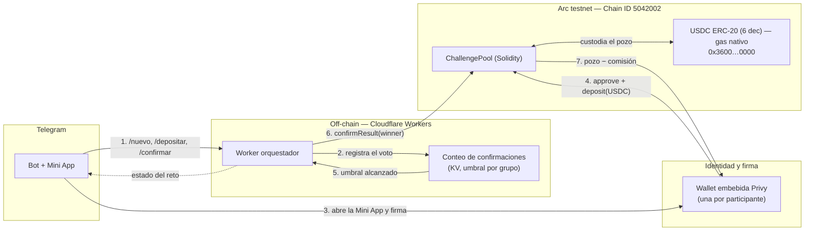

# Diagrama de arquitectura — flujo en Arc

Diagrama del delta construido en ETHOnline 2026 (track Continuity). Muestra el
recorrido del dinero de punta a punta sobre **Arc testnet** y separa con claridad
dónde vive el consenso (off-chain) de dónde ocurre la liquidación (on-chain).

> En esta entrega el rendimiento queda fuera de alcance: no hay `TreasuryVault`
> ni adaptador de Aave. El pozo permanece en `ChallengePool` entre el depósito y
> el pago. Ver `docs/PRODUCT.md` para el alcance completo del MVP previo.

## Flujo de dinero

## Dónde vive cada cosa

| Paso | Dónde se ejecuta | Verificabilidad |
| --- | --- | --- |
| 1–3 | Telegram + Worker (off-chain) | No on-chain |
| 2, 5 | Worker — **el consenso es off-chain** (conteo de votos en KV) | Promesa del backend, no garantía del contrato |
| 4 | Firma **directa del usuario** vía Privy → `approve` + `deposit` | On-chain, evento `DepositReceived` |
| 6–7 | **Liquidación on-chain** en `ChallengePool` | On-chain, eventos `ChallengeResolved` / `ChallengeRefunded` |

El contrato garantiza la ruta de fondos: el ganador que recibe el pago debe ser
un participante del reto, y ninguna cuenta operadora puede redirigir el pozo a
una dirección arbitraria. El *umbral* de consenso, en cambio, lo aplica el
Worker: el contrato recibe un ganador ya decidido.

## Rol de Circle / Arc

Arc es la L1 de Circle, EVM-compatible (Solidity, Foundry, viem), chain ID
`5042002`. En Arc **USDC es el gas nativo** y expone una interfaz dual sobre un
único saldo:

- nativa (`msg.value`, `address.balance`) — 18 decimales
- ERC-20 (`balanceOf`, `transfer`, `transferFrom`) — 6 decimales

`ChallengePool` usa la interfaz ERC-20 para toda la lógica de aplicación, no
tiene funciones `payable` y nunca lee `msg.value` ni `address(this).balance`.
Detalle en [`packages/arc/README.md`](../../packages/arc/README.md).

## Rol de Privy

Privy aporta la **identidad y la firma dentro de Telegram**: una wallet embebida
por participante, sin frase semilla ni extensión de navegador. Es la pieza que
permite que un usuario de Telegram deposite USDC (paso 4) manteniendo la firma
en el propio usuario — el Worker nunca firma depósitos.

## Referencias

- Contrato: [`packages/arc/src/ChallengePool.sol`](../../packages/arc/src/ChallengePool.sol)
- Despliegue y transacciones: [`packages/arc/deployments/arc-testnet.json`](../../packages/arc/deployments/arc-testnet.json)
- ABI consumido por el Worker: [`packages/arc/abi/ChallengePool.json`](../../packages/arc/abi/ChallengePool.json)
